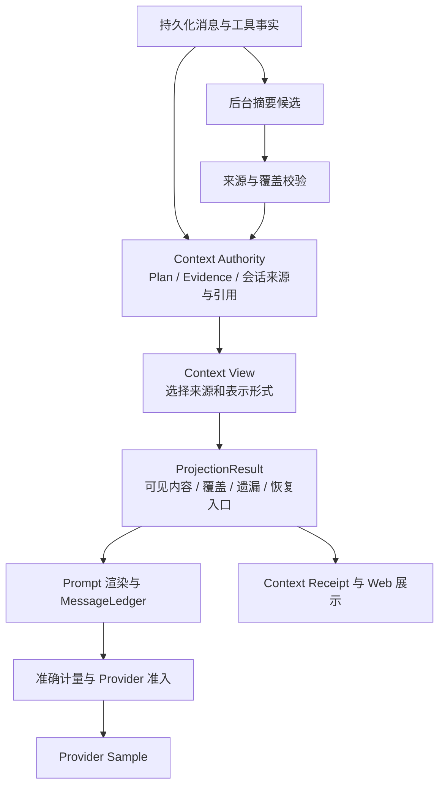

**QCode 上下文连续性与压缩优化方案**

状态：P0–P4 已实施；P5 已实现观测、默认切换与本地回放，真实模型评测待提供测试连接和预算。日期：2026-10-08。阶段结果见[上下文连续性契约与基线](./context-continuity-contract.md)。阶段交付边界以验收记录为准，脚本回归不替代真实模型效果验收。当前配置以[配置说明](./configuration.md)和[架构设计](./architecture.md)为准。

P1 已交付：统一原文选择与精确遗漏；本次请求即时恢复提示；规范化后的完整计量及净缩减闭环；显式 `recent_tail_turns=0` 的容量模式；采样回执中的 `context_projection_digest`。P1 交付时默认保留 2 轮，P5 已切换为容量选择。原文消息索引以源历史 digest 为作用域；P2 另以不可变终答来源提供稳定问题身份；P4 提供有界查询，P5 将完整选择目录写入请求诊断。

P2 已交付：完成轮终答的 Markdown AST 索引、稳定来源组/条目 ID、原始编号与字节范围；`update_plan.context_selection` 和 Plan 步骤的稳定 ID/引用；每次请求即时装入必要定义并计入完整准入；ConversationState 进入 Snapshot/Delta/Manifest，正文单独存入 CAS，焦点更新复用正文。摘要不再自动提升执行 Todo。P4 已补上未绑定候选过大时的目录恢复；显式绑定依赖本身放不下仍明确返回容量不足。

目标：用户连续提出“分析问题 → 修复第 1 项 → 继续第 2 项”时，模型直接获得问题定义、来源和处理进度；长任务进入压缩、摘要失败、恢复会话或切换模型后，仍能可靠接续。模型输入、后台工作与持久化读取均有明确资源边界。

本方案复用现有 Runtime、Context Authority、Plan、Evidence、MessageLedger、CAS 和 Turn Kernel。会话语义归 `internal/runtime/agent/context`，不引入独立任务调度器、第二份 Transcript 或第二套模型调用循环。

P4 已交付：Checkpoint 按当前来源与最近闭合轮选择，总投影受公开字节预算和完整请求余量限制；`turn_history` 支持稳定 source/item、目录与 digest 绑定的 UTF-8 分页。未绑定定义过大时先进入恢复采样，实际工具入口阻止业务执行，绑定后下一次采样装入完整定义才恢复。续跑点持久化焦点、Plan、来源与恢复状态；无法恢复已接受上下文时明确失败。Fork 与模型切换保留来源身份，子任务独立继承所选定义并检查 token/字节预算，CAS 共享根和失败暂存清理已加入回归。默认 `recent_tail_turns=2` 保持到 P5。

P5 已交付：每次 Provider attempt 的无正文选择目录、最后一次选择与校准回执、前台恢复计数、后台摘要生命周期与费用诊断，以及 Web 折叠详情。默认采用容量选择，摘要额度零值不再补回固定上限；双开关调度与缓存复用相互独立。固定中文会话的参考配置/新默认对照加入 Benchmark V2。真实模型语义质量和费用验收仍待明确连接与预算。

**1. 已确认的问题与设计取舍**

P0 审计确认的主要问题以及相应改动如下；已修复项以阶段结果为准：

| 当前问题 | 目标改动 |
| --- | --- |
| 默认最近 2 轮包含当前轮，窗口富余也隐藏第一轮 | 默认以实际容量选择历史；轮数只作为显式原文上限 |
| Continuity 只取最后一次终答，覆盖原任务的问题清单 | 保存带来源的可引用结论，进度关联到具体项 |
| post_turn 只摘要已经离开轮数窗口的消息 | 闭合轮立即保存确定性的接续信息；摘要准备与历史淘汰解耦 |
| 每条摘要输入先截为 1,024 字节 | 在整体预算内按结构分块，记录完整覆盖范围 |
| 历史遗漏提示只考虑轮数 | 输入选择、遗漏原因、恢复指针统一来自同一个投影结果 |
| 下一轮通过 joinPendingNarrative 等待后台摘要 | 后台只提交不可变候选，前台在安全边界选择已经准备好的候选 |
| 全部 Checkpoint 每次进入 Dynamic | 持久化保留全部检查点，模型只接收本次所需的投影 |
| 把“旧问题正文不出现”写成测试要求 | 断言当前引用可解释、来源有效、状态正确且预算满足 |

审计中已用脚本 Provider 验证：声明窗口 131,072 tokens、硬输入 130,944 tokens 时，全部历史和固定提示估算约 1,550 tokens，窗口压缩事件为 0，第三轮 Provider 请求仍不含第一轮的问题 2 定义，而历史 Findings 中保有该定义。这证明首要缺陷发生在输入投影；提高压缩水位不能单独解决。

设计优先级依次为：任务语义正确、输入与协议合法、故障可恢复、资源与成本可控、缓存和延迟优化。更大上下文通常增加输入成本，因此同时衡量一次完整任务的总成本、恢复往返和完成质量，不能仅比较单次请求 tokens。

**2. 必须成立的上下文契约**

以下为契约摘要，正式验收边界、现有测试支撑和未实现门禁见[上下文连续性契约](./context-continuity-contract.md)。基线通过不代表全部契约已达标。

| 编号 | 契约 |
| --- | --- |
| C1 | 当前用户请求、有效用户约束、未决审批/输入及不可中断的 Provider 续写状态不得被静默裁掉 |
| C2 | 正在处理的引用必须有定义和来源；不能仅提供“问题 2”或历史 Handle 就宣称上下文完整 |
| C3 | 结论的持久身份不随列表显示位置、压缩次数、投影起点或模型变化而改变 |
| C4 | 普通进度消息不能覆盖仍相关的原始报告；修复一项不改变其他项的定义和状态 |
| C5 | 对拟淘汰的有效语义，先确认替代表示可用，再改变模型视图；摘要排队不等于替代成功 |
| C6 | 模型摘要属于有来源的解释，不能产生测试通过、文件已修改、审批已通过等权威执行事实 |
| C7 | 投影和恢复提示共享一个选择结果；被省略的来源必须有准确原因及合法的读取入口 |
| C8 | 所有实际 Provider 请求满足冻结 Route 的窗口与协议约束，完整计入工具定义、封装、续写和输出预留 |
| C9 | 投影不能损坏完整工具调用配对；压缩后的逻辑历史不得与 Provider 增量会话里的隐藏前缀不一致 |
| C10 | 后台摘要不阻塞下一轮，不改写正在采样的快照，不覆盖后续用户纠正和工作进展 |
| C11 | 历史、来源、投影选择和使用量可以回放；撤回、恢复、Fork 与 CAS 回收保持一致 |
| C12 | 所有资源决策来源于公开配置、模型/Provider 能力或运行时观测，不使用隐藏比例、关键词权重或模型档位 |

“保证连续性”不意味着把无限事项都标为 mandatory。必须区分当前不可缺少的信息、可分页的相关材料和无关历史。若当前依赖本身超过容量，应拆分读取并保留阶段性结论；若不可再缩的请求和控制状态仍超限，应如实报告容量不足，不能在缺少问题定义时开始修改代码。

**3. 目标数据流与职责**



| 所有者 | 职责 | 不承担的职责 |
| --- | --- | --- |
| `context` | 来源身份、结论引用、语义条目、覆盖证明、快照及恢复规则 | 不执行 Provider，不操作 UI |
| `contextview` | 预算内选择、去重、压缩候选比较和遗漏清单 | 不读写持久化，不改业务账本 |
| `prompt` | 将已选事实和来源解释渲染成模型输入 | 不重新判断哪些轮次应遗漏 |
| `engine` | 编排采样、闭合轮处理、摘要作业、恢复和安全边界安装 | 不建立第二套任务状态机 |
| `turnkernel` / `app` / `persist` | 既有事实提交、终态持久化、独立维护提交及回放 | Host 不介入选择或摘要逻辑 |
| `wire` | 构造与注入能力、配置、持久化及共享限流器 | 不驱动后台业务循环 |
| `common/contextsnapshot` | 必要的跨层父子上下文数据契约 | 不包含会话选择策略 |

保持 `MessageLedger` 是单次模型输入装配的唯一所有者。Plan 继续表示工作计划，Evidence 继续表示已观测执行事实，新增的会话状态仅表示“先前说过什么、当前引用什么、这些引用依赖哪些来源”。

**4. 让问题清单和结论可以被稳定引用**

在 `context.Authority` 中增加 `ConversationState`，纳入同一 Context Snapshot。扩展现有 `TurnFindings` 的来源描述与可引用项，不再只保存一个 Conclusion 字符串。以下为逻辑字段，具体 Go 类型应复用现有契约：

| 对象 | 关键字段 | 语义 |
| --- | --- | --- |
| `SourceRef` | thread、turn、message ID、content digest、block/range | 不可变原文出处，不是可见窗口下标 |
| `ReferenceGroup` | group ID、source、原始标题、item IDs | 一份报告、方案或备选集合；不同报告的“第 2 项”属于不同 group |
| `ReferenceItem` | item ID、原始显示编号、原文范围、父项、相关 Plan 引用 | 保留编号与正文的关系，不以摘要标题作为身份 |
| `ConversationSelection` | 当前来源组、被引用项、有效约束来源、替代关系 | 本次工作关注哪些材料，不代替 Plan 的执行状态 |
| `Representation` | source refs、raw/extractive/semantic、内容引用、覆盖集合、生成来源 | 同一来源的不同表示形式 |
| `Coverage` | input ranges、covered item IDs、omitted ranges、fidelity | 机械可验证的覆盖情况，不伪装成语义正确性的证明 |

来源 ID 在权威消息追加时确定，利用既有 durable Item/Message 身份或稳定的“轮次内追加序号 + 内容摘要”。不直接复用依赖当前切片 index 的身份算法。重复文本、重试输出与分支来源仍须可区分。

结论保存分两步进行：

1. 闭合完成轮从已提交的用户可见终答建立确定性来源索引。列表、标题和代码块使用结构化 Markdown Parser；Parser 只认语法和范围，不根据“P2”“待修复”等关键词决定是否有执行义务。嵌套列表保留完整路径，代码块内的数字不当作问题编号。无结构的正文先作为完整的可引用块保存。
2. 后台模型可补充语义标题、关系或摘要，但每条必须引用有效原文范围。解析失败时保留原始块，不使语义抽取成为正常接续的前置条件。

当前 Go 侧没有可直接复用的 Markdown AST 解析器时，引入成熟解析库并在 `context` 的内容索引边界使用；不为了这一功能先建设通用多语言解析平台，也不使用逐行正则模拟 Markdown。

进展仍由已有权威来决定：

- “报告指出问题”只代表被报告的结论，不自动进入执行 Plan。
- 用户要求实施后，Plan 的具体步骤可以关联 item ID；Plan 状态与验证回执按来源展示。
- “已完成”和“已验证”分别来自计划/终态与验证证据，不从一句摘要推导二者等价。
- 用户撤销、纠正或提供新版本时追加带来源的替代关系；旧原文保留在历史中，退出本次有效表示。
- 交付方案的未来步骤保持 deliverable 语义，不因摘要产生 pending 项就自动开始实施。

为此给 Runtime PlanStep 增加稳定的 step ID 与可选 reference item IDs，并在现有 `interact` 计划工具输入中提供对应引用字段。Engine 校验引用属于本会话且仍有效；相同标题不再自动意味着同一事项。会话选择更新只记录引用绑定与用户来源，不创建新的执行工具链；现有 Plan 更新、用户 Recovery/Plan Transition 和终态事实仍是推进工作的入口。

“继续第 2 项”的解析优先使用显式回复/引用、已有 Plan 绑定、当前报告组。缺少明确绑定时，把活动报告的编号索引和必要原文提供给主模型判断，不再增加一次隐藏的意图分类调用。有多个同样可能的报告时保留歧义，请主模型按上下文判断或向用户澄清；不能自动把“第 2 项”映射到最近一次任意输出。

普通新 prompt 不自动清空旧任务。焦点转移可以作为带用户来源的选择更新提交，但不能顺带把旧计划标为完成或删除原始结论。明确切换任务后，旧报告不继续以当前义务呈现；全局用户约束继续按其作用域有效。

目标视图示例：

```text
当前请求：继续优化原报告的第 2 项。
报告 R，来源：第 1 轮已提交终答。
R/1：锁范围不正确。关联计划已完成；相关测试通过。
R/2：重试时丢失原始请求。当前处理项；定义和必要代码定位随本次输入提供。
R/3：取消后状态未清理。仍是报告结论，尚未承诺实施。
```

“R/2”身份保持不变。删除、完成或重排第 1 项不导致其他项重新编号。

**5. 按容量和任务依赖选择模型输入**

窗口计算继续使用权威能力与显式预算：

```text
W = 当前 Route 的模型上下文容量
O = 本次有效输出预留（受模型上限、显式配置和经济预算约束）
H = W - O
M = 不可缺少的控制状态、当前请求及已经确认的当前依赖的输入成本
R = max(0, H - M)
```

公式中的输入成本必须包含真实渲染和协议封装。缓存 token 依然占上下文，不因为命中缓存而从 H 中扣除；Provider 观测值用于校准估算。未知模型限制仍要求完整元数据，不能用模型名称猜窗口。

`M` 不是另一套先验百分比分区。选择过程采用清晰的优先级，不引入带权打分：

| 顺序 | 内容 | 压力下的行为 |
| --- | --- | --- |
| 1 | 系统/安全约束、当前用户请求、未决交互、不可拆续写与工具协议结构 | 必须保留；放不下时明确拒绝 |
| 2 | 当前目标和有效纠正、当前 Plan 项、未验证修改、正在引用的问题定义 | 先使用无损表示；无法整体放入时拆分来源读取并限制执行 |
| 3 | 活动报告的其他编号索引、最近用户可见结论、必要决策依据 | 在余额内保留；大集合分页且声明未载入范围 |
| 4 | 最近完整因果组，以及与当前项直接关联的更早来源 | 从近到远加入；已有短表示时不重复加入同一长正文 |
| 5 | 已消费的大工具输出、已完成无关任务、历史检查点与可选背景 | 最先缩减模型可见体积；原文按已有合同留存 |

容量充足时可以保留多轮历史，但不为填满窗口而加载全部磁盘归档。最近的内存历史按因果组选择；更早归档通过活动来源引用载入，避免每轮扫描全会话。源长度、估算和依赖索引按内容摘要缓存，选择成本主要随候选工作集变化。

这一选择规则需要可验证的索引实现：闭合轮增量更新每轮 token 元数据、来源引用和因果组边界；累积量用于寻找可装入的范围，实际候选仍经最终 TokenEstimator 校验。省略目录使用范围/来源组聚合，不在每次 Sample 重新展开所有旧消息。索引可以分页持久化，内存只保留当前选择及索引页，限制沿用现有公开存储合同或本次明确新增的配置；不能把缩小模型输入后节省的资源重新消耗在全量历史扫描上。

同一来源通常只在原文、摘录、语义摘要中选一种正文表示；必要的 item ID / source ref 可以作为元数据伴随。已经在原文中的终答不再完整复制到 Session State；当前连续性说明也不在自然语言头部与 JSON 账本中双份输出长正文。

累计 tokens、费用和 TPM/Burst 沿用既有独立准入平面。显式经济预算可以限制工作集，但不得伪装成模型窗口不足。恢复来源的元数据不会绕过成本预算；需要延迟或结束时使用相应的预算原因。

**6. 统一投影结果与最终准入**

将“选出一个 tail start”升级为可描述多种表示形式的 `ProjectionResult`。具体状态归 `context`，选择算法归 `contextview`。逻辑结果包含：

```text
source_revision / source_epoch / route_digest
selected_sources + selected_representations
required_references + coverage
omissions[{source, reason, available_representation, retrieval_arguments}]
estimated_partition_tokens / output_reserve / limiting_constraint
projection_digest
```

这里的 omissions 是完整可持久化清单，模型只接收预算内的相关项与汇总；不能将无限遗漏目录又全部塞入 mandatory。读取完整目录走同一会话的有界查询。

模型采样的过程固定为：

1. 冻结本次 Route、上下文版本、有效指令、源索引和预算。
2. 由确定性事实得到核心状态及已有的引用绑定。
3. 选择可见来源和表示形式，同时计算覆盖与遗漏。
4. Prompt 根据该结果渲染正文及恢复指引，MessageLedger 生成不可变快照。
5. 对最终请求计量，包括遗漏指引自身、工具 Schema、动态内容和续写。
6. 若超限，降级一个明确的可选候选并重新渲染。候选只能向更小表示移动，必须严格减少成本；禁止对同一 digest 无限尝试。
7. 覆盖与协议校验通过后提交 Provider Sample，并保存同一 projection digest 的 Receipt。

为避免“提示变长又挤掉历史”的循环，恢复提示具有结构化聚合表示。每次降级都重算提示并检测最终净变化；不能靠未记录的固定重试次数掩盖非收敛算法。

`history_token_ceiling` 和原文轮数上限只约束普通原文历史。正在被明确引用的必要来源在依赖分区表示，并计入总输入与任何显式 mandatory 上限。必须在配置说明中写清这个区别，不能通过分区转移绕过总预算。

**7. 压缩策略和失败降级**

压力下优先降低已经消费的机械输出成本，保留任务语义。处理顺序如下：

| 层次 | 操作 | 接受条件 |
| --- | --- | --- |
| A | 省略已被当前表示覆盖的重复正文、无关旧检查点、已失效的可选背景 | 来源与有效约束仍可追溯 |
| B | 已闭合、已消费的大工具结果转为事实摘录与 Handle；配对参数保留必要身份 | 符合 ResultStore、Guard 与协议合同；未读结果不能提前当作已消费 |
| C | 用已校验的接续表示替换旧因果组或报告的重复解释 | 当前项定义与 required refs 覆盖成立，实际 tokens 严格减少 |
| D | 对当前轮的已闭合组做最小足够的替换，保留最近因果链和当前请求 | 按最少信息损失选择满足预算的候选，不直接选择能删掉最多消息的 cut |
| E | 必需来源太大时按稳定 item / section 分段读取，保存阶段性结论 | 未获得依赖前不得推进需要它的代码修改；分页不能丢编号与来源 |
| F | 不可再缩前缀或显式预算仍不满足 | 返回准确的 capacity / budget / continuation 原因，不宣称已经保留全部语义 |

摘要不可用时使用确定性原文摘录、结构化账本和有界恢复。摘录必须标明范围与未覆盖部分；不能用“前几百字符 + 完整”替代一份报告。当前请求若引用尚未载入的源，优先恢复对应 item，而非重新搜索整个仓库。

保留既有工具首次准入与同一轮 append-only 原则。没有硬容量压力或用户显式压缩请求时，不为节省 token 反复重写已经发送的工具结果。确需替换会影响增量前缀时，推进 Context Window，并按 Provider 能力显式重新建立逻辑上下文；不能继续使用绑定旧前缀的增量状态。Stateless 与 Incremental Provider 接受同一语义选择合同。

显式 `thread.compact` 与自动投影使用相同覆盖校验和来源规则。用户主动压缩可以等待必要准备，但只有替代视图实际安装后才报告完成；后台 post_turn 不沿用这种等待语义。

**8. 摘要输入、输出与覆盖校验**

删除每消息默认 1,024 字节前缀截断和基于英文关键词的保留优先级。整体输入预算由 summary Route 的剩余窗口、显式上限和单次作业预算共同决定，使用相应 TokenEstimator；字节值仅作为公开的存储/传输限制，不以固定 bytes/token 比例冒充最终准入计量。

分块按“消息 → 标题/列表项/段落/代码块 → 必要的源码区间”进行。每块包含 `SourceRef`、范围、父结构和完整/部分标记。单块仍超预算时继续切为可追溯子范围，保留行号及边界，不直接丢尾部。图片和 Provider 专属块继续使用原生能力合同，不能假装文本摘要涵盖了未读取的附件。

每次只处理尚无可用表示的源块，按 source digest、summary Route 与摘要规则版本幂等去重。长历史不会在每轮从头重新摘要，也不会只把上次摘要作为唯一来源反复压缩。合并摘要始终保留原始 source refs，必要时可回到原始块校验。

摘要输出包含 item 级内容及其覆盖声明。校验至少检查：

- 所有引用属于当前可见权限范围，digest 和原文范围匹配；不能凭空引用 ID。
- 当前 required refs、活动编号和用户约束来源都有对应表示；未覆盖项明确列出。
- 原始显示编号与稳定 ID 一致；关键字面标识如路径、符号和错误码不得被校验层悄悄改写。
- 成功、授权、修改等执行结论仍由 Truth / Evidence / Receipt 确认。
- 输出长度和渲染后的总请求满足预算，且替换确有净收益。

来源有效与 ID 覆盖只证明机械完整性，不证明自然语言忠实。当前被引用项的标题、定义关键原文或短原文块仍保留为校验锚点；语义质量由回放评测验证。覆盖失败的候选保留为不可安装结果，继续使用上一份有效表示或原文。

如对缺失块发起补充摘要，必须限定在已有超时、重试和成本预算内。不存在“直到摘要成功”的无限修复循环。摘要输出目标根据拟替换源体积和可用空间推导；无净压缩收益时保留原文。

**9. 轮次结束、后台摘要和并发提交**

完成轮的路径拆成两个明确边界：

| 阶段 | 时机 | 提交内容 |
| --- | --- | --- |
| 确定性闭合 | 已提交终答、终态和现有 Context 提交边界内 | 原文引用、TurnFindings、编号结构、Plan/Evidence 关联以及基础接续状态 |
| 可选摘要 | 完成轮有新的可复用源或容量规划产生待替换组时 | 不可变摘要候选及独立使用量，不修改旧终态 |

确定性闭合必须先于下一轮读取 Context。它不调用模型，可以与已有 Context Manifest/终态事务一起提交；若实现采用可回放的派生索引，必须以已提交事实为源幂等重建，不能把尚未提交的内存结论当作终态。

后台候选捕获固定的 thread、epoch、source turn/message refs、source digest、Route digest 和生成规则版本。运行与结算不再通过 `e.currentTurn()`、当前可变 history 或当前 Plan 推断源轮。源轮身份必须一直随候选传递。

移除 Execute 对 optional narrative 的无条件 join。下一轮直接使用已提交的确定性状态和已有有效摘要；只有当前 Sample 尚未采样的安全边界可以安装新表示，同一 Sample 快照不可变。

后台返回后：

1. 检查线程存活、来源未撤回、epoch 与权限仍有效。
2. 以来源集合核对候选；不能因为无关新轮到来就覆盖整个 ConversationState，也不能简单要求所有旧全局状态一字不差。
3. 通过现有持久化协调路径提交独立的维护事实/Context revision，仅更新该来源的 Representation。发生版本冲突时重新校验并合并局部表示，不覆盖新 Plan、约束和选择。
4. 作业费用按唯一调用身份结算一次，包括生成成功但最终未安装的候选；丢弃候选不能丢弃费用。

同一线程可串行执行摘要作业，将重复待办按 source digest 合并；这是单写入所有权约束，不引入按模型名称决定的并发数。全局资源沿用共享 Provider 调度/限流与显式作业预算。前台获得优先调度，后台不长时间占用前台执行锁。

作业预算具体复用已有 `semantic_narrative_timeout` 作为一次捕获源集合的执行总时限，覆盖分块、重试和补全，不能每个分块重新获得完整超时。单次请求受输入/输出 ceiling 限制，整个作业计入共享 session tokens/费用预算，结束后未覆盖部分仍保留原文或待处理索引。若要给后台单设费用或 tokens 上限，必须新增公开配置及 provenance，不能从主预算暗扣固定比例。

调度区分“本地准备”和“模型生成”：闭合轮总是保存来源索引；后台生成只针对活动来源中需要更短表示的新增/变化块、实际投影拟淘汰的组，或显式 compact 请求。已有可用短表示、来源无变化或不需要减小体积时不调用 summary Provider。无独立费用上限不代表无限作业：来源集合有限、digest 去重、总时限和共享预算共同约束；重试耗尽的相同失败输入不因每轮到来自动重试。

P3 已将模型执行、超时、限流和重试统一收敛到 `engine` 摘要调用路径；`context/narrative_service.go` 只提供请求准备和预算，输入/输出数据及校验由 `context` 负责。

未完成、失败或用户暂停的轮不发起新的总结采样；原始已提交事实照常保存。线程关闭/删除取消其后台作业，恢复与撤回使不适用的候选失效。进程重启后候选可由固定来源重建，不能把后台 channel 持久化为业务状态。

**10. 有界恢复、Checkpoint 与长期会话**

将 Checkpoint 的 durable 内容与模型可见内容分离。持久化仍逐轮 write-once；模型侧按本次 selected sources 呈现，不再无条件附加全部检查点。`checkpoint_max_bytes` 是本次可选检查点投影的总预算，不再被理解为每轮无限累加的独立额度。

上下文容量不足或引用不确定时，恢复按以下粒度进行：当前 item 定义 → 所属报告索引 → 相关消息范围 → 必要时整轮分页。继续复用 `turn_history` 和 `result_get`，为 `turn_history` 增加互斥的稳定 item/source 选择形式及明确的 cursor/范围合同；保留现有 `turn` 读取形式。模型提示必须来自工具真实 Schema，使用合法的 `turn` 参数，不再把 `preferred_turn` 伪装成输入字段。

Runtime 可在组装前通过已有 Context Repository 补齐已绑定的会话来源。这是读取本会话的持久化上下文，不是绕过 Guard 执行文件搜索。每次源读取受本次可用输入、分页合同和 CAS 大小边界限制；源码与外部工具数据的读取仍走现有工具与安全路径。

所有恢复都应用线程身份、父子继承范围、撤回标记和来源 digest 检查。已经压缩的内存片段不能被当成完整原文返回：来源元数据要说明是否完整，并在缺少所请求范围时回到正确的归档。不能因为内存中还剩一条该轮消息就跳过完整归档。

移除一概“不要回读历史”的提示。只对已完整覆盖的来源说明无需重复恢复；缺失来源给出精确读取入口。正常的后台装载不必在主对话里播报内部检索细节；真正缺少可恢复信息或发生用户可感知等待时应如实说明。

**11. 持久化、撤回、模型切换和 Subagent**

ConversationState 与新增 Representation 进入既有 `ContextSnapshot`、`SessionState/Delta` 和 Context Manifest 的同一提交链。正文通过现有 CAS 引用，Manifest 仅保存必要索引/Owner 引用；新增引用必须计入 `ContentIDs`、根/边关系、staging 清理和 GC，避免每次终态复制所有报告正文。

| 场景 | 目标行为 |
| --- | --- |
| 进程恢复 | 从提交的 Context 状态恢复 item 身份与绑定；缺少派生索引可从原文重建，不调用模型才能启动 |
| Withdraw / Revert | 恢复对应基线并失效被撤回来源的表示与绑定；不能从残留摘要重新引入已撤回内容 |
| 用户纠正 | 新来源显式替代旧结论；旧来源可审计，但不得继续作为当前事实 |
| 文件已变化 | 报告仍是“当时的发现”；相关定位/验证有效性由现有 workspace binding 与 Evidence 重新判断 |
| 模型或输出配置切换 | 重算表示成本和最终准入，保留模型无关 item 身份；失效不兼容 Provider replay 与估算缓存 |
| Session Fork | 复制授权的上下文状态并保持来源 lineage；目标线程独立更新选择与进度 |
| Subagent | 通过既有 context snapshot 模式继承所选任务/结论及必要原文；受子模型独立预算和权限限制 |
| 子任务结果回传 | 作为带来源的报告输入；父任务的 Plan/验证状态仍经过既有主 Agent 处理 |

不建立第二个全局记忆数据库，不把所有来源复制到所有子 Agent。`fresh` 继续不继承父上下文；其他模式的当前任务语义不能因为简单的消息条数上限而被静默裁掉。

当前项目尚未公开稳定持久化格式。本次不建设预发布兼容迁移框架。新增派生字段如可保持原有缺省编码与 digest 语义，则按需重建；若必须改变持久化契约，显式升级对应格式并按既有边界拒绝不支持的版本，不能在读取时静默改写旧摘要。是否需要格式升级在契约阶段通过序列化、缺省字段和历史 Fixture 测试确定，而非先写多版本迁移。

**12. 配置语义与默认值**

以下配置已随 P5 同步到 schema、defaults、provenance、环境变量、校验、快照和中文说明。P1 支持 `recent_tail_turns=0`；P4 实施 Checkpoint 总预算；P5 将容量选择设为默认。

| 配置 | 当前默认/语义 | 显式正值 |
| --- | --- | --- |
| `context.view.recent_tail_turns` | 默认 `0`：不以固定轮数提前裁剪普通原文，按容量选择 | 普通原文候选的轮数上限，继续包含当前轮；当前请求不得隐藏 |
| `context.view.history_token_ceiling` | 保持 `0`：使用 mandatory 之后剩余硬容量 | 普通原文分区的额外上限 |
| `context.view.checkpoint_max_bytes` | `0`：按本次剩余容量选择检查点表示 | 本次检查点分区总上限，取代逐轮独立额度 |
| `context.compact.truth_max_bytes` | 保持 `0`：从实际容量导出 | 明确的必要状态分区上限，冲突时报告 operator ceiling |
| `prepare_tokens / auto_compact_tokens / emergency_tokens` | 保持 `0`：无额外提前档位 | 公开的 operator ceiling；不能跳过覆盖校验 |
| `semantic_narrative_max_input_tokens` | 默认 `0`：由 summary Route、封装和作业预算导出 | 单次摘要输入 ceiling；更长来源必须分块 |
| `semantic_narrative_max_output_tokens` | 保持 `0`：模型能力、剩余窗口和替换目标共同决定 | 额外的摘要输出 ceiling |
| `semantic_narrative_item_max_bytes` | 默认 `0`：在总预算内分配；移除隐含逐消息 excerpt cap | 单条表示上限；超限只能分块或声明未覆盖，不能丢尾部后当成功 |
| `semantic_narrative_max_items` | 默认 `0`：按来源项数与总预算决定 | 单次作业项数上限；未处理项进入有界后续批次 |
| `context.view.digest` | 默认改为 `ledger+narrative`：允许选择已校验且有净收益的语义表示 | `ledger` 仅使用确定性状态、原文和无损摘录，不自动生成摘要 |
| `context.view.narrative_mode` | 保持 `post_turn`；`off` 禁止可选生成 | 两种模式都保留确定性会话连续性 |

`digest` 控制是否使用语义表示，`narrative_mode` 控制是否新生成。只有 `ledger+narrative` 与 `post_turn` 同时成立时才自动调度生成；`ledger+narrative` 与 `off` 可以复用已校验且仍有效的缓存表示，但不能发起新摘要调用。相应调整现有组合校验。任何取值都不能关掉确定性接续信息，也不能因为启用 narrative 就复制原文和摘要；停止生成不删除既有来源。

现有显式正值不能被隐藏常量二次收紧。`recent_tail_turns=2` 仍可表达用户主动选择的原文上限，但不会授权删除当前 item 的必要定义。语义改变需要明确发布说明和配置边界测试。

不增加默认“70% 开始压缩”“固定保留 8 轮”“大型模型多保留若干倍”等经验档位。存储或协议确有绝对安全上限时，必须作为公开字段提供来源、验证、边界测试和准确错误；语义条目分页，不靠悄悄减少条目解决安全上限。

**13. 可观测性与用户体验**

扩展现有 Context Receipt / Budget Snapshot，记录本次实际选择及其来源，不让 Host 扫描历史推导。包括：

- 冻结窗口、输出预留、各分区成本、显式 ceiling 与估算校准来源。
- 原文/摘录/语义表示的 source IDs、覆盖状态和 projection digest。
- 遗漏原因：容量、operator 限制、重复表示、明确失效或不属于本次工作。
- 摘要准备、安装、过期、覆盖不全和无净收益的结果，以及已实际发生的费用。
- 前台恢复次数与字节数、后台摘要占用、可选摘要是否阻塞前台。

来源 ID 和完整遗漏目录属于会话诊断/回执，不能成为高基数监控标签；默认日志不记录原始用户内容、完整工具正文或密钥。新增观测复用现有脱敏和权限规则。

Web 普通视图只需展示可理解的状态，例如“当前任务信息已保留，较早工具输出按需读取”。展开详情才能看到原文范围、摘要覆盖和预算原因。轮数变化、工具结果分页与真实压缩使用不同事件原因，避免所有情况都显示成一次“压缩失败”。

评估以完成任务为单位：当前项定义/编号/状态保持率、无必要历史恢复次数、重复文件读取、首响应延迟、总输入输出、缓存失效与总费用。参考配置与 Provider 必须一致，按相同会话回放比较；省输入 tokens 但增加模型恢复轮数不自动判定为收益。

**14. 分阶段实施与文件边界**

| 阶段 | 工作与主要文件 | 完成标准 |
| --- | --- | --- |
| P0：契约与基线（已实施） | 正式化 C1–C12；把三项复现放入 `engine`/`context` 的回归测试；建立多问题中文会话 Fixture | 已在 Provider 请求层稳定证明原问题；Fixture 不依赖真实模型；见[基线与升级规则](./context-continuity-contract.md) |
| P1：统一选择结果（已实施） | `context/projection.go`、`contextview/selection.go`、`engine/context_view.go`、`model_handler.go`、`history_recovery.go`、`prompt/context_selection.go`；配置支持显式 0 | 中文 Fixture 在容量模式下逐项保留原文定义；token 裁剪与恢复提示一致；规范化请求、工具定义、续写和提示完整计量并验证净缩减。正值上限下的稳定依赖由 P2 接入；P5 已切换默认 |
| P2：稳定接续信息（已实施） | `context/conversation*.go`、`authority.go`、`plan.go`、Snapshot/Delta/Manifest、`contextview/conversation.go`、`prompt/conversation.go`、Engine 终态与采样入口；扩展现有 `interact` 计划合同 | 报告逐项处理不会丢定义或重编号；计划与结论/验证不混淆 |
| P3：摘要候选与异步安装 | `context/compact_narrative.go`、`narrative_service.go`、`engine/narrative.go`、`turn_handler.go`、`app/context_maintenance.go` | 分块覆盖完整；前台不 join；迟到结果不覆盖新状态；使用量准确 |
| P4：压力、恢复与生命周期（已实施） | `contextview/checkpoints.go`、`context/conversation_ranges.go`、`engine/model_handler.go`、`tool/turnhistory`、续跑/Fork/子任务与 `persist/contextstate` | 硬压力、经济预算、摘要关闭、撤回、重启及模型切换回归通过；Checkpoint 总投影有界；必要定义先恢复后执行，分支调用归属独立 |
| P5：观测、文档与发布门禁 | `protocol`、Context Receipt、Web 投影、`config`、中文指南和回放评测 | 契约与体验门禁通过，生成文件同步，默认配置切换并报告质量/成本结果 |

依赖顺序：P0 → P1 → P2 → P3 → P4 → P5。P1 和 P2 的内部代码可分提交，但不会以“调大轮数”作为整个优化已经完成的验收。默认配置的切换在 P1–P4 联合验收后随 P5 生效；迁移期间使用明确的原文上限配置做对照，不长期维护两套上下文算法。

P2 同时修改 `adapter/tool/interact` 的计划引用合同和 `turnkernel`/`app` 对应事实提交；P3 的生成器职责收敛不是另建一条 Provider 通道。阶段验收失败时保留已有有效原文表示，不强行启用新压缩默认值。上线后可用既有显式原文上限和 `narrative_mode=off` 控制资源与生成行为，但关闭摘要不回退稳定来源、权限或状态正确性；持久化格式不兼容时不能用旧二进制覆盖新状态文件。

关键文件现状入口：
[输入视图](../../internal/runtime/agent/engine/context_view.go)、
[轮次边界](../../internal/runtime/agent/context/history_boundary.go)、
[接续结论](../../internal/runtime/agent/engine/turn_checkpoint.go)、
[摘要调度](../../internal/runtime/agent/engine/narrative.go)、
[摘要输入](../../internal/runtime/agent/context/compact_narrative.go)、
[Context Manifest](../../internal/runtime/agent/context/session_manifest.go)、
[历史工具](../../internal/adapter/tool/turnhistory/turnhistory.go)。

不趁此改造 Provider 业务协议、Guard、沙箱或仓库索引。只有上下文身份/Receipt 需要的跨层数据进入 common 或 protocol；不得通过导入 Engine 解决 Host 或持久化层的数据需求。

**15. 验收矩阵与测试方法**

| 场景 | 必须验证的结果 |
| --- | --- |
| 三轮短对话：报告 → 修第 1 项 → 继续第 2 项 | 第三轮首次实际 Provider 请求包含第 2 项定义；无需为恢复整份报告额外调用工具 |
| 多项报告跨多轮逐项处理 | 每项 ID、编号和来源不变；已完成项不重新执行；未处理项不被进度消息覆盖 |
| 中文/英文长报告，关键项在 1,024 字节之后 | 所有需要的项进入分块输入，摘要覆盖可核对；不因语言关键词得到不同保留待遇 |
| 嵌套列表、编号重排、多个报告均有第 2 项 | 结构索引不混淆；有歧义时不猜错报告 |
| 无 Plan 的纯分析、交付方案、用户明确开始实施 | 纯报告可持续引用；交付方案不被自动变成执行义务 |
| 摘要关闭、超时、429、损坏输出、遗漏 item | 当前任务仍可执行或准确报告缺少依赖；不能装入坏摘要、无限重试或阻塞下一轮 |
| 下一轮在后台返回前开始；同时有用户纠正 | 当前快照稳定；候选只更新对应源；不会恢复旧 Plan/旧约束 |
| 轮数与 token ceiling 分别触发省略 | 两者都产生与真实输入一致的遗漏理由和有效读取参数 |
| 极小窗口、大工具结果、超长当前轮 | 逐级减小表示并保持配对；最小前缀超限时返回正确原因 |
| 输出预留变化、Provider 缓存/增量状态、显式经济预算 | 全量逻辑窗口计算正确；不存在隐藏前缀超窗或无声突破预算 |
| 缺失/部分内存历史、归档分页和长 Findings | 精确范围从完整来源读取；不会把残片当作全部历史 |
| Restart、Withdraw、Revert、Fork、Subagent | 身份和来源隔离正确；撤回内容不再注入；CAS 回收不会删除活跃引用 |
| 长会话含大量已完成轮 | 模型可见 Checkpoint 总量受预算限制；不随已完成轮线性增加必带正文 |
| 明确切换到新任务 | 旧报告不成为新义务；需要时仍能按来源恢复，用户全局约束不丢失 |

确定性测试直接检查 `ModelRequest` 和其 projection digest，不只断言 Prompt 含有某个工具名。异步测试使用 channel/barrier 控制先后，禁止用容易抖动的固定 sleep 证明“不等待”。预算测试覆盖多个模型能力、输出预留、边界值与显式配置，不将某一模型规格写入策略。

性质测试检查：同输入结果确定、扩大容量不无故丢失原本选中的必要来源、缩减总能终止、工具配对完整、无重复源正文、遗漏与实际差集一致、序列化/恢复身份稳定。摘要文本的忠实度另用人工核对的会话集和模型评测验证，不能由 JSON 通过校验替代。

现有“旧 P2 正文绝不能出现在下一轮”用例应改成两类：有来源且仍被引用时必须保留；无出处、已撤回或明确不相关时不得当作当前事实。原测试中防止捏造、半开工具链和越权恢复的约束继续保留。

实施时按阶段执行聚焦测试，契约落地后执行相应集成与生成检查：

```bash
go test ./internal/runtime/agent/context ./internal/runtime/agent/contextview ./internal/runtime/agent/prompt
go test ./internal/runtime/agent/engine ./internal/adapter/tool/turnhistory
go test ./internal/runtime/app/... ./internal/persist/contextstate
go test -race ./internal/runtime/agent/engine ./internal/runtime/app ./internal/persist/contextstate
make protocol-schema
make web-protocol-check
npm --prefix web run check
npm --prefix web test
make docs-check
git diff --check
```

命令按修改范围执行，环境受限失败单独报告。真实 Provider 评测需使用明确的测试连接与预算，不能拿用户生产会话做无上限试验。发布前保留同一 Fixture 和模型配置下的旧/新回放结果；必要语义、权限与持久化不变量必须全部通过，性能和总费用回归要给出测量与原因。

**16. 交付范围与完成定义**

交付包括：统一投影与计量、稳定来源和问题引用、可选摘要的分块/校验/异步安装、有界恢复和 Checkpoint 投影、持久化生命周期、公开配置与观测，以及相应测试和中文文档。完成后把已经实施的契约合并到架构、配置、使用和 Agent 指南；方案文档不长期保留与当前实现冲突的说明。

完成标准是：上述验收矩阵全部有自动或明确记录的评测证据，典型逐项接续不再因为上下文策略恢复整份报告，摘要不可用不破坏当前任务语义，输入和成本边界可解释。仅调整轮数、扩大摘要长度、增加提示词或增加回读重试，都不构成本方案完成。

目前已交付方案、P0–P4，以及 P5 的实现和本地回放。B1 已升级为正值轮数上限下的正向回归：原报告定义进入每次实际 Provider 请求，不依赖摘要或额外恢复工具。B3 保持 P1 的精确遗漏回归；B2 已升级为 P3 完整来源范围与实际模型请求的正向回归。P2 还覆盖同轮焦点更新、来源替代、计划重排、快照/Manifest 往返、Fork 与撤回基线、缺失正文拒绝和容量失败；P4 已补齐压力、目录恢复、续跑、Fork、模型切换、子任务继承与 CAS 生命周期回归。P3 已移除前台 join，安装只更新解释性表示，并独立保留失败调用费用。P5 已切换默认并增加请求目录、回执、后台维护诊断和 Web 展开视图；真实模型语义质量和费用验收尚待明确测试连接与预算。
