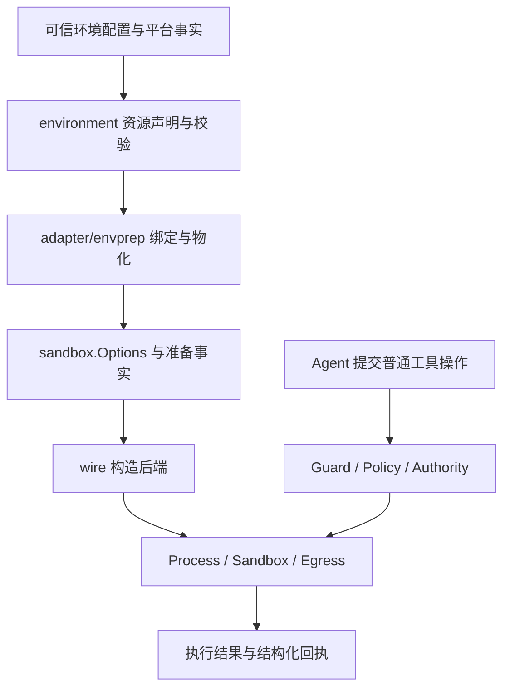

# 执行环境通用化优化方案

状态：P1–P4 已实施，历史夹具已清理，代码与文档验收通过。日期：2026-09-29。

本方案基于当前工作区代码，包括正在进行的环境包拆分。目标是让 QCode 执行任何
编程语言的项目时，都使用同一套环境声明、授权和进程执行机制。接入一种新语言
不应要求修改 Runtime、环境准备器、Guard 或 Sandbox。

本文明确调整[原环境重构方案](./sandbox-execution-environment-plan.md)中默认
Go 发现和 GOPROXY 自动认证的设计。各阶段的交付范围见下方记录，其余章节描述整体目标；
当前行为以[架构文档](./architecture.md)和源码为准。实施时须同步更新现行手册与原方案，
避免保留互相冲突的产品约定。

### P1 实施记录

2026-09-29 已交付：

- 删除 Go 发现器、`go env` 启动探测、`go.mod` 分析和自动 Go 缓存声明。
- 环境指纹仅报告 OS 与架构，不启动语言工具或 Git 版本命令，不报告宿主登录 Shell。
- 空 `auth_services` 配置保持未绑定；删除宿主 GOPROXY 自动认证与对应测试开关。
- 真实 Go 编译样本改为显式声明工具链和缓存，仍执行沙箱内外结果对照。
- 更新中文产品文档，并删除已失去调用点的两条进程副作用登记。

验证结果：空工作区、Python 项目及带挂起语言工具的 Go 项目均完成 Runtime 初始化，
探针调用记录为空。显式声明的真实 Go 沙箱编译测试实际执行并通过，没有跳过。
当时的 `environment`、`adapter/envprep`、`platform/envprobe`、`platform/process`、
`runtime/app/wire`、`adapter/tool/guard`、`adapter/tool/shell`、`security/goproxy`
八个包的 race 检查通过；`make docs-check security-side-effect-check` 与
`git diff --check` 通过。

原 `platform/envprobe` 已收拢至 `runtime/agent/prompt.DefaultBaseSystem`，直接以
`runtime.GOOS` 与 `runtime.GOARCH` 生成平台信息；不执行宿主工具的回归测试随之迁入。

P1 仍保留 Git Discoverer、进程层语言变量处理和显式 GOPROXY 服务；这些分别按
P2、P3 继续清理。本阶段未改变默认 Profile、权限与凭证隔离规则。

### P2 实施记录

2026-09-29 已交付：

- 环境准备、PATH/SDK/证书绑定、沙箱策略与命令执行使用同一来源；准备完成后不再
  回读宿主环境。显式空来源不继承宿主变量，完整来源快照不进入准备结果或策略。
- 新增纯规则包 `security/envpolicy`，统一来源选择、变量校验与分层合并。
  普通变量按来源基线、可信声明、命令声明覆盖；同层异值和重复资源名报错。
  HOME、临时目录和受管代理仍由策略生成，秘密名与解释器预加载防护保持有效。
- Git 配置文件声明移至 `adapter/tool/git`，由 wire 组合；删除 `Discoverer`、
  `DiscoverInput` 和准备器发现器列表，编译器直接使用 `security/model`。
- 删除进程层 Go 变量清单与只读命令的 Python 自动开关。macOS 开发工具目录在
  准备阶段确定，Shell 预检使用准备后的 PATH，并识别命令级 PATH 覆盖。
- 子 Agent 继承父策略的环境选择结果与平台绑定，重新绑定独立 Home 和缓存；
  隔离结算保留已准备环境，显式空切片在传递中保持为空。
- 同步架构、配置、安全、阅读指南、Agent 指南与原环境方案。

验证结果：未知工具在真实沙箱中读取声明配置、写入私有缓存，命令级覆盖生效，
未声明文件读取与只读工作区写入均被拒绝；该测试实际执行通过，没有跳过。
来源变更、显式空来源、SDK/证书绑定、声明冲突、子 Agent 环境继承与兄弟缓存
隔离测试通过。14 个相关包的 race 检查通过，覆盖环境契约/实现、进程、沙箱、
Git、Shell、wire、隔离结算、Guard、MCP、Egress、配置与安全依赖约束。
`make sandbox-attack-test`、`make docs-check security-side-effect-check` 与
`git diff --check` 通过。

显式 GOPROXY 服务及其消费链仍属于 P3；本阶段没有改变 `v1`、主 Agent 默认
`native`、子 Agent `isolated`、共享临时区默认关闭的约定。

### P3 实施记录

2026-09-29 已交付：

- 删除 `security/goproxy`、`wire/auth_service.go`、`auth_services` 配置、专属限额、
  校验与来源记录。所有信任级别的旧配置均明确报未知字段，空列表也不例外；
  错误只列字段路径，不打印配置值。配置来源快照通过既有测试更新命令生成。
- Runtime、Guard、Shell 不再依赖认证服务类型，Shell 不改写 GOPROXY，也不根据
  服务存在与否保持联网。代理删除 `UpstreamAuthService`、绑定器、origin-form
  分发及专属上游阻断；普通 HTTP / CONNECT 继续通过 Gate 和现有审批。
- 通道仅接受自己的 `Proxy-Authorization`；origin-form 认证后返回 400，未认证
  返回 407。代理凭据不转发上游，普通目标的 `Authorization` 保持原义。
- 环境准备事实以不可变快照经 Guard 上下文传入 Shell，独立放入
  `environment_preparation_facts` Metadata；成功、失败和 PTY 轮询均保留，不把
  无关准备失败归因为当前命令错误。独立子环境使用自己的快照。
- `credential/use` 保留资源身份，但无绑定器时明确未绑定；必需声明生成
  `credential_binder_unavailable` 准备事实，不假称凭证可用。
- 同步架构、配置、安全、阅读指南和历史方案；未增加语言插件或通用凭证代理。

验证结果：13 个相关包的 race 检查通过，覆盖配置、环境契约与实现、Egress、
Sandbox、变量规则、Guard、Shell、wire、进程、隔离结算、MCP 和安全依赖约束。
普通代理拒绝、通道隔离、CONNECT 清理、旧配置拒绝、准备事实隔离与 PTY 回执
测试通过。`make sandbox-attack-test`、`make docs-check security-side-effect-check`
与 `git diff --check` 通过，真实沙箱攻击测试实际执行，无环境限制失败。

私有制品认证需由用户显式接入的受限外部服务提供，通用 `credential/use` 声明本身
不交付凭证。完整验收由 P4 收口。

### P4 实施记录

2026-09-29 已实现：

- 增加从可信 TOML 配置、Runtime 构造、线程 Guard 到 Shell 和真实 Sandbox 的未知工具
  集成验收，覆盖配置精确读、私有缓存写、命令覆盖、准备后宿主环境变化、前台、PTY、
  后台及 `write_stdin`、普通失败退出码、独立子 Agent 与兄弟缓存拒绝。准备事实贯穿
  执行与轮询；工作区只读、未声明邻居文件、凭证文件与符号链接逃逸继续被拒绝。
- 启动测试同时证明 PATH 语言桩未被初始化触发、显式工具调用确实执行；声明 PATH
  覆盖使用同一安全规则，不依赖本机开发工具的优先级。
- 将旧 Go/Rust/Node capability 样本改为显式工具配置与缓存声明；保留真实编译、
  版本查询、子进程和 TLS 校验证据，删除过时的自动语言适配假设。
- 接回通用 Mach-O 传递依赖绑定，仅绑定有效库文件与加载必需的精确别名。删除未使用的
  Homebrew 配置目录扫描；不自动开放相邻配置文件。当时 TLS 样本显式声明 OpenSSL
  配置；后续修复已将可选加密配置的空值缺省行为纳入统一环境准备，Node/npm 和 TLS
  回归改为无额外配置声明执行，同时验证显式配置优先级与未授权文件仍被拒绝。
- 修复临时 Runtime 在私有 Home 创建前编译缓存声明的问题，并验证主、子环境关闭时
  回收。共享用户临时区补齐写树的元数据权限，已有文件的内容读取仍被拒绝。
- 更新架构说明、阅读指南和下方验收证据；未改变 Runtime 协议形状，无需重生成协议。
- 后续收尾删除 EDS/Go JSON 夹具、嵌入解析辅助函数、静态基线观察和测试专用平台
  能力矩阵。编译测试改为通用声明，保留网络目标、凭证未绑定、环境变量、缓存与
  共享临时区根目录绑定的实际断言。

验证结果：15 个相关包的 `go test -race` 通过，覆盖配置、环境契约/实现、平台指纹、
变量规则、Sandbox、Egress、Git、Guard、Shell、wire、进程、隔离结算、MCP 和安全
依赖约束。完整 `go test -tags=capability ./internal/platform/process -count=1` 与
`make sandbox-attack-test` 通过；Go/Rust/Node、编译临时区与 TLS 样本实际执行通过。
构造失败清理和相对 RPATH 拒绝的补充 race 测试通过。`make security-side-effect-check`
通过（189 个调用点、34 条所有权规则），`git diff --check` 通过。

P4 初次验收时，`make docs-check` 因工作区文档删除产生的失效链接未通过。
后续夹具清理完成后重新验证：`go test ./internal/adapter/envprep`、
`make docs-check` 与 `git diff --check` 均通过，当前文档检查已无此阻塞。

## 1. 决策与范围

采用以下方案：保留环境契约与准备实现的分工，移除默认执行链中的语言专属知识，
以可信资源声明提供环境能力，并从产品执行链移除内置 GOPROXY 认证服务。

| 领域 | 目标边界 |
| --- | --- |
| 环境契约 | 表达变量、文件、目录、缓存、网络目标、来源与生命周期 |
| 环境准备 | 根据声明和平台事实绑定资源、创建私有目录、生成沙箱配置 |
| Agent | 按任务读取项目说明、构建配置，通过普通受控工具查询和执行 |
| 构建工具 | 解释语言版本、依赖格式、缓存语义和工具链选择规则 |
| 安全执行 | 对资源和操作授权，约束文件系统、进程与网络，产生结构化证据 |
| 特殊认证 | 由用户显式接入的受限外部服务负责，不由 Runtime 默认探测和绑定 |

核心验收句：一个测试夹具中临时生成、QCode 从未认识过的工具，只靠通用资源声明，
就能读取所需配置、写入私有缓存，并在同一安全边界内执行。

本轮不建设语言插件市场、开发环境安装器或通用凭证代理框架。包名迁移也不作为
前置条件。QCode 自身采用 Go 实现、构建测试使用 Go，以及项目理解工具中的语法解析
和 LSP 能力，都不属于本轮删除对象。需要清理的是默认环境和通用执行链中的语言行为。

## 2. 改造前问题与证据

| 当前实现 | 问题 | 处理 |
| --- | --- | --- |
| 原 `wire/sandbox_home.go` 固定装配 Go 发现器 | 任意工作区都探测 Go；`go env` 错误可中断沙箱构造 | 删除默认 Go 发现及其实现 |
| 原 Go 发现器查询 Go 变量、分配 Go 缓存 | 环境准备器需要知道语言工具的配置规则 | 改由通用声明提供变量与资源 |
| 同文件扫描 `go.mod`、比较版本、解释 `GOTOOLCHAIN` | 通用准备阶段承担项目构建分析 | 删除该逻辑，项目分析经 Agent 正常工具链完成 |
| 原 `platform/envprobe` 默认运行 Go、Node、Python 版本命令 | Runtime 构造仍持有语言清单，并执行 PATH 中的工具 | 默认提示词只记录运行平台事实 |
| `platform/process/environment.go` 枚举 Go 变量 | 进程层按语言判断环境继承 | 按来源、声明与安全类别处理 |
| `platform/process/process.go` 为只读命令注入 `PYTHONDONTWRITEBYTECODE` | 只读语义依赖某种解释器的开关 | 由文件系统权限保证只读，变量由调用者显式配置 |
| `wire/auth_service.go` 默认读取 GOPROXY 和宿主凭证来源 | 空认证配置仍触发语言专属认证 | 移除隐式认证和内置 GOPROXY 绑定 |
| Guard、Shell 和回执依赖 `goproxy.Service` / `BindReport` | 专属服务已成为通用执行链的依赖 | 删除服务注入，将仍需保留的环境事实独立传递 |
| 出网代理包含 GOPROXY origin-form 分发与上游直连阻断 | 通用代理承担模块协议语义 | 随专属服务一起清理，保留通用出网治理 |

已有通用基础可以复用：`ResourceRequest`、`EnvironmentSpec`、`CompileSpec`、
`PreparedEnvironment`、可信配置的 `execution.environment.resources`，以及没有
Discoverer 也能准备环境的现有测试。无需另建一套环境系统。

## 3. 目标架构与包职责



环境准备给出可用资源和后端配置；每次执行仍绑定 Operation、Authority 和 Lease。
资源可以完成绑定，不等于某次调用已经获得使用它的权限。图中的准备链不产生
绕过 Guard 的第二条执行通道。

| 包 | 保留职责 | 调整 |
| --- | --- | --- |
| `internal/common/environment` | 声明、校验、Profile、结构化事实 | 保持纯契约；删除失去调用方的 Discoverer 接口，不加入宿主探测或可变报告仓库 |
| `internal/adapter/envprep` | 平台基线、声明编译、私有目录物化、沙箱配置生成 | 删除 Go 实现；编译器直接使用 `security/model` 的访问类型 |
| `internal/runtime/app/wire` | 配置与依赖构造 | 不执行语言查询、不分析清单、不绑定默认语言认证 |
| `internal/platform/process` | 命令环境应用、进程和 PTY 生命周期 | 不读取语言变量清单，不按解释器改写运行语义 |
| `internal/runtime/agent/prompt` | 默认系统提示词与运行平台信息 | 直接使用 Go Runtime 的 OS 与架构，不执行宿主工具或将登录 Shell 当作实际执行 Shell |
| `internal/security/egress` | 目标授权、代理通道认证、连接治理、撤销与回执 | 不解析模块路径或决定语言代理行为 |
| `internal/adapter/tool/guard`、`shell` | 工具治理、进程会话与结果 | 不依赖 GOPROXY 类型，不改写语言专属变量 |

环境契约位于 `internal/common/environment`，供 Config、Guard、Shell 与 Egress 共享，
仅依赖标准库。准备器位于 `internal/adapter/envprep`，依赖契约与安全实现。
调用方使用 `environment.ResourceRequest` 描述资源，通过 `envprep.Prepare` 准备环境。
两者保持独立 Go 包，避免契约调用方引入宿主准备与沙箱实现依赖。

### Git 与平台依赖的界线

Git 是 QCode 现有版本控制能力依赖，可以保留其专门的 Git Adapter。它不应成为
通用环境准备器保留生态发现注册表的理由：当前 `Git.Discover` 的配置路径发现归入
Git 集成，由 `wire` 显式组合其资源声明。准备器只接收声明；没有其他调用方后，
删除 `Options.Discoverers`、`Discoverer` 和 `DiscoverInput`。

PATH、可执行文件的实际依赖、macOS SDK、临时目录和 TLS 信任源属于平台执行基础。
可以保留基于公开平台接口的发现，但它们必须遵守同一环境来源和路径授权；不得
顺带恢复某种语言的安装目录猜测、包缓存约定或工具链版本判断。

解释器预加载变量等现有安全规则按其威胁模型保留；清理业务语言特例不能顺便删除
已有防护。任何后续精简都需要独立的安全证据。

## 4. 环境声明与执行语义

### 4.1 一个来源快照

受控进程使用准备时确定的来源快照，避免准备器、证书发现和进程启动分别读取变化中的
宿主环境。准备完成后，`process.NewCommand` 不再用新的 `os.Environ()` 为受控执行
补充环境。可信 Runtime Helper 的环境规则单独保留，不由普通工具获得该身份。

`SourceEnv == nil` 捕获一次来源；显式空切片表示不继承宿主变量。平台定义的最小
PATH 等基线仍可按公开规则补充。完整快照仅用于必要的准备过程，不能整体进入
`PreparedEnvironment`、日志或持久化记录；执行端接收经过选择和过滤的值。

现有 `execution.environment.source` 在当前准备链主要承载来源标识，不能把填写一个
名字描述成已经支持容器、远端环境或任意来源解析。本轮不增加这类后端；来源 ID 和
来源版本也不能仅靠默认 `startup` 字符串冒充变更检测。

### 4.2 明确合并与约束

普通非敏感变量的合并顺序为：平台与来源基线、可信环境声明、经过验证的单次命令
声明。后者可覆盖前者，同一声明层的同名冲突直接报错，不依赖切片顺序静默取值。

HOME、临时目录、受管代理地址等由安全策略拥有的值，单独根据 Profile 和当前
执行权威生成，不能被普通环境声明改变其授权含义。变量覆盖本身不授予文件访问或
网络访问；涉及路径或端点的资源仍须另行绑定和授权。

保留 `v1`、主 Agent 默认 `native`、子 Agent 固定 `isolated`、共享临时区默认关闭的
约定。保留宿主 HOME 的变量值不代表开放整个 Home。未知变量不因语言名称而放行，
也不因缺少语言适配器而拒绝显式声明；已有秘密、预加载和策略保留字段规则继续生效。

### 4.3 复用现有配置形状

以下示例使用现有资源配置字段，表达一个未知工具的配置和缓存。路径为示意值，必须
替换为实际受信任的资源；它不声明新协议或新的语言插件。

```toml
[execution.environment]
contract = "v1"
profile = "native"

[[execution.environment.resources]]
name = "build-tool-config"
namespace = "host_config"
access = "read"
path = "/absolute/path/to/tool.conf"

[[execution.environment.resources]]
name = "build-tool-cache"
namespace = "cache"
access = "write"
path = "sandbox-home/cache/build-tool"
env = "BUILD_TOOL_CACHE"
tree = true
```

将变量名换成某工具文档规定的名称，不需要更改 Go 代码。用户可以复用可信环境配置，
不必每条命令重新声明。项目文件和 Agent 输出不能自行升级成可信配置；工作区写权限
继续使用现有命令级 `write_paths` 与结算链。

通用声明也不意味着自动识别所有工具的环境。工具需要额外安装、路径或配置时，Agent
可按任务通过普通受控工具处理；Runtime 不在启动阶段扫描所有项目清单、猜测配置或
自动安装依赖。

## 5. GOPROXY 与凭证能力的处理

### 5.1 推荐终态

从产品代码移除 `internal/security/goproxy` 及其默认和显式装配，不将同一实现改名为
“通用服务”后继续常驻。不为本轮新增认证插件注册中心或动态执行宿主脚本的入口。

连带移除 `EnvironmentAuthService`、`auth_services`、GOPROXY 专属校验与限额、
`SkipHostGoproxyAuth`、宿主 GOPROXY 测试注入字段，以及 Guard 的 `ModuleProxy`。
检查并清理对应的加载、克隆、来源追踪、导出和生成配置引用。

Shell 不再根据认证服务是否存在改变联网判断，也不自动重写 GOPROXY。联网仍由
当前执行权威、显式命令目标、已声明环境目标和已有 loopback 规则决定。

### 5.2 保留的安全能力

保留 Session Gate、通道身份认证、目标授权、DNS 与地址校验、连接撤销、跨调用隔离
和结构化拒绝事实。删除的是 GOPROXY 的协议处理和秘密注入，不能连带删除通用代理
通道的临时认证凭证。

清理代理的 origin-form 分发和 `BoundHost` 逻辑前，核对真实调用方：只有 GOPROXY
使用的分支随服务删除；其他实际消费者需要的传输能力继续保留并以协议行为测试。
未经授权的 origin-form 或直连请求不能因为删除旧分支而落入无校验转发。

已有模型 Provider、MCP 等独立能力的凭证引用与解析不属于本轮删除范围。普通环境
声明仍不能携带长期秘密；`credential/use` 若没有实际绑定器，应明确返回未绑定事实，
不能因为能编译为资源就报告认证已就绪。

### 5.3 行为变化与替代边界

移除后，QCode 不再自动利用宿主 GOPROXY userinfo 或 `.netrc` 完成私有 Go 模块下载。
依赖该功能的环境需要显式配置已有的受限外部制品服务，或暂时报告所需能力不可用。
本轮不承诺自动私有依赖下载的体验完全等价。

外部服务负责自身的凭证保管、制品路径范围和上游约束；QCode 负责授权可连接的端点。
允许连接一个代理不代表 QCode 能验证它访问的全部上游，也不自动证明其凭证隔离。
服务的真实授权范围必须可说明；不接受凭证透传、任意出网或默认开放全部 loopback
作为替代。现有后端无法表达所需端点权限时，明确报告能力缺口。

普通 HTTPS CONNECT 只提供隧道端点控制，不替代应用层认证服务。后续如确有独立的
认证集成需求，应单独定义输入、权限、生命周期和验收样本。

## 6. 环境事实与错误回执

`environment.Fact` 继续作为共享类型。准备器的 `PreparedEnvironment.Facts` 通过
Runtime 和 Guard 的普通执行上下文传入 Shell，不再借用 `goproxy.BindReport`。
优先传递不可变快照；不新增持久化报告库或第二套执行状态。

准备时的缺失资源用于展示环境状态。只有可以关联到当前操作所需资源的事实，才能
参与该操作的失败分类；无关的缺失工具或未使用配置不能污染其他命令的错误原因。
关联依据是资源身份和执行上下文，不能从命令正文或 stderr 猜测语言和因果。

Gate、OS 后端和已有权威组件仍提供结构化事实。只有退出码和普通输出时，分类保留
`unknown`，展示真实诊断；不得把 stderr 中的 `401` 或 `permission denied` 自动
转换成认证或授权结论。已开始产生副作用的命令不因补环境而自动整段重放。

## 7. 实施顺序与文件范围

各阶段使用独立、可验证的变更，最终验收覆盖完整链路。下面的阶段号表示依赖顺序，
不代表工期估算；P1 到 P3 期间遗留的 GOPROXY 链不计为已经完成通用化。

| 阶段 | 主要工作与路径 | 阶段验收 |
| --- | --- | --- |
| P1 移除隐式语言探测 | 删除 Go 发现器与默认 Go 装配；默认提示词仅保留 OS 与架构；`wire/auth_service.go` 取消宿主自动认证回退 | 空工作区、非 Go 工作区以及 PATH 上存在失败或挂起的语言工具时，初始化均不触发这些工具；空认证配置不探测或绑定宿主认证 |
| P2 统一环境来源与声明 | 修改 `adapter/envprep/{prepare,compile,sandbox}.go`、`platform/process/{environment,process}.go`；删除 Go 变量清单、Python 自动注入；Git 集成自行提供声明，清理 Discoverer 接口 | 未知工具用声明完成配置读取与缓存写入；受控执行不回读宿主环境；Profile、声明覆盖和路径拒绝测试通过 |
| P3 移除语言认证消费链 | 修改 `wire` 状态与构造、`guard/{guard,pipeline_attempt}.go`、`shell/{protocol,environment_receipt}.go`、`security/egress`；独立传递环境事实；删除 `security/goproxy` 和配置入口 | Guard/Shell/Runtime 无 GOPROXY 类型或变量改写；普通出网、拒绝、撤销、PTY 和会话清理行为保持受控 |
| P4 收口与产品验收 | 清理旧测试开关、样本依赖、配置引用，更新中文文档和受影响的生成文件 | 所有最终验收场景通过，已交付文档同步为目标行为，无未声明的体验回退 |

P1 中 Go 缓存等测试先改用显式资源声明，保留其沙箱覆盖；剩余专属认证仅是通向 P3
的短期中间状态，不新增长期兼容开关。P3 的生产依赖、配置移除和事实传递在同一
可编译变更中完成，不能只删服务文件。

本项目尚未稳定发布，本轮不增加旧格式 Migration。删除的配置字段继续由严格解析
报告错误，并在文档给出替代配置方式；不得静默忽略或自动把秘密转换成普通环境变量。
`v1` 契约名和通用 `Fact` / 资源字段不因实现清理而无条件升级版本。

需要同步的中文文档包括 `architecture.md`、`configuration.md`、`security.md`、
`reading-guide.md`、`agent-guide.md`、`sandbox-execution-environment-plan.md`。
只有实际变更 Runtime 协议形状时才执行 `make protocol-schema` / `make web-protocol`，
不得手改生成产物。按安全入口变更维护现有契约，不引入行数或函数长度棘轮。

## 8. 验收矩阵

| 场景 | 必须证明的结果 | 验收证据 |
| --- | --- | --- |
| 默认初始化 | 不执行 Go、Node、Python 等版本或环境命令；语言工具缺失不生成启动失败事实 | `wire/environment_startup_test.go` |
| PATH 上的语言工具为记录调用的桩 | 构造 Runtime 后调用记录为空；通过普通工具显式调用时才执行 | `wire/environment_startup_test.go` 中真实 Guard 显式执行 |
| 未知工具 | 无 Discoverer，仅凭配置文件、变量和私有缓存声明完成运行 | `wire/environment_execution_test.go`：可信配置到真实沙箱 |
| 来源快照 | 准备后修改宿主环境不改变同一次已绑定执行；显式空来源不恢复宿主变量 | `adapter/envprep/source_test.go`、wire 主/子执行 |
| 环境覆盖 | 普通变量按规定优先级合并，同层冲突拒绝；HOME、临时区和代理约束不被覆盖 | `security/envpolicy/environment_test.go`、`process/environment_test.go` |
| 资源边界 | 精确读、私有树写成功；未声明路径、越界路径和符号链接逃逸拒绝 | wire 未声明路径/链接拒绝、`security/sandbox` 攻击验收 |
| 只读命令 | 不依赖 Python 变量保证只读，真实文件系统写入被后端拒绝 | wire 未知工具写拒绝、`process/process_capability_test.go` |
| 子 Agent | 使用独立私有 Home，继承权限不超过父级；环境变量不带来额外路径授权 | wire 主/子/兄弟真实执行及缓存内容隔离 |
| 普通网络 | 已批准目标可用；未批准目标、私有地址、撤销后的访问按现有规则拒绝 | `security/egress` 授权/撤销、`process/process_capability_test.go` |
| 空网络声明 | 仅按真实执行权威及已有环境目标解释，不因隐藏认证服务获得联网能力 | `shell/environment_receipt_test.go`、wire 空目标声明执行 |
| 代理清理 | 无认证的通道使用和非法 origin-form 请求不能成为转发旁路；连接与进程取消后正确回收 | `egress/session_test.go`、`process/session_process_capability_test.go` |
| 凭证 | 初始化不探测 GOPROXY 或 `.netrc`；长期秘密不进入进程环境、回执或日志 | wire 启动与执行、`config/removed_environment_config_test.go` |
| 失败事实 | 无关准备事实不分类当前失败；结构化拒绝保留来源，普通程序错误保持真实退出码与正文 | `shell/preparation_facts_test.go`、wire 真实退出码 37 |
| 执行形态 | 前台、PTY、后台、`write_stdin` 与子 Agent 使用一致的环境和授权规则 | wire 前台/PTY/后台/轮询/子 Agent 集成验收 |
| 配置演进 | 删除的 `auth_services` 字段明确报错；通用资源配置仍可加载，来源与信任校验生效 | `config/environment_resources_test.go`、`removed_environment_config_test.go` |

以未知工具夹具验证抽象，再以已安装的不同语言工具做代表性集成样本。Go 编译测试
仍可保留，但必须经通用声明准备；它不是“支持语言清单”，也不能替代未知工具测试。
删除适配器后保留路径、网络和凭证防护的覆盖，不以删除旧断言掩盖行为回退。

实施时先运行受影响包测试，再扩大到消费方：

```bash
go test ./internal/common/environment ./internal/adapter/envprep ./internal/config ./internal/runtime/agent/prompt
go test ./internal/platform/process ./internal/adapter/tool/guard ./internal/adapter/tool/shell ./internal/runtime/app/wire
go test -tags=capability ./internal/platform/process
go test -race ./internal/platform/process ./internal/security/egress ./internal/adapter/tool/guard ./internal/adapter/tool/shell ./internal/runtime/app/wire
make sandbox-attack-test
make docs-check
git diff --check
```

执行结果见上方各阶段实施记录。按 Git 集成实际落点补充其包测试；若改变
Runtime 协议或 Web 配置界面，再运行协议消费者和 Web 检查。真实沙箱能力受环境
限制时单独报告，不能将跳过写成通过。新增或调整必要资源上限时，沿用公开配置或
协议契约，补齐来源、校验和边界测试，不引入隐藏探测预算。

## 9. 完成标准

本方案只有同时满足以下条件才算完成：

1. 工作区初始化与普通执行不依赖任何语言工具的存在、配置或版本。
2. 新语言可以通过现有工具执行和通用环境声明工作，无需修改核心实现。
3. 默认执行链不再包含 Go 项目分析、语言变量清单、解释器业务开关或内置 GOPROXY。
4. 凭证保密、资源授权、沙箱隔离、网络治理、日志与回执约束继续成立。
5. 自动私有依赖认证的取消及其替代边界已清楚记录，配置和文档没有隐式兼容回退。

本轮的优先级是消除语言耦合并验证通用路径。环境包改名、更多平台支持、自动环境
发现体验和特殊认证集成都不应阻塞这条主线。
