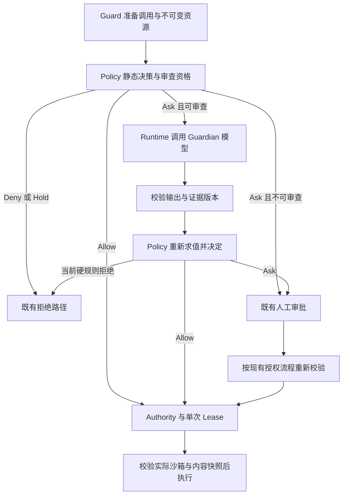

# QCode Guardian：模型审查式 Auto Review 设计方案

状态：P0–P6 实现与合成样本验收已落地，真实持久 Runtime 审批恢复已补齐。默认关闭；显式启用后可在审计与当前授权校验通过时自动放行。模型结果及使用边界见评估文档。版本：v2。日期：2026-10-10。

本文定义目标行为、接口和验收条件，阶段进度与实现边界见第 13 节。当前行为以
[安全模型](./security.md)和源码为准；实现须遵守
[架构依赖规则](./architecture.md#硬依赖规则)。

## 1. 问题与当前事实

Guardian 的目标是在 Auto 下，对满足自动审查资格的操作补充语义评估，减少不必要的
人工审批。它不扩大工具权限，不替代沙箱，也不把模型推测当作用户批准。

当前分类由 `internal/security/model/assessment.go` 的决策表产生，不能把所有开发命令
笼统视为 medium，也不能认为所有文件变更都能通过 Git 恢复：

| 实际效果 | 当前典型分类 | 对本方案的意义 |
| --- | --- | --- |
| Strong Sandbox 内无工作区写入、无网络的进程 | `process.read_only / low / reversible` | 通常已经允许，无需增加模型调用 |
| 进程写入声明的工作区范围 | `process.mutating / high / bounded` | 需区分通用进程的保守分类与确定的危险语义，不能仅凭 high 排除全部开发任务 |
| 只开放 loopback 的进程 | `network.read / medium / bounded` | 仍需人工确认，medium 不等于可自动审查 |
| 可携带数据出网的进程 | `network.mutating / high / irreversible` | 第一版不自动审查放行 |
| 显式宿主执行 | `process.mutating / high / irreversible` | 遵守现有单次审批与 Full Access 契约 |
| 命中硬拒绝或 critical 分类 | Deny/Hold | Guardian 不得介入覆盖 |

`go test` 的具体效果取决于写入、网络和执行环境声明；`npm install` 可能执行安装脚本
并联网；`git restore` 可能丢失未提交内容。命令名称不是风险或可逆性的充分证据。

本方案保留原有 `securitymodel.Effect`，新增独立的自动审查资格与模型评估证据。
原始风险、模型判断、最终授权来源分别记录，不能通过调低 Effect 掩盖放行依据。

## 2. 第一版范围与不可覆盖的边界

### 2.1 自动审查资格

由 Policy 的纯计算逻辑统一生成 Review Candidate；现有 typed-grant 自动审查与
Guardian 共用不可覆盖条件，再各自检查其效果范围。不能在多个放行分支复制一组更宽的
条件，也不能只检查 `Decision.Layer`。

第一版 Guardian 仅接受同时满足以下条件的调用：

1. 会话处于 Auto，Guardian 已启用，`DisableAutoReview` 未开启。
2. 原始 Ask 仅来自默认 Posture；Constitution、Managed Grant、Repository、User、
   Surface、Planning 和 Binding 均没有另外要求人工确认或拒绝。
3. 审批要求为 `ApprovalReusable`。`ApprovalFresh`、`ApprovalFreshOnce`、工具声明的
   `ApprovalOnce` 和强制编辑计划审阅均不可由 Guardian 满足。
4. 属于可信目录中已登记支持审查的内置命令 Binding，具有匹配的目录身份和版本，且为
   `CapabilityProcess`、`StageCall`。不能只根据工具名或参数里是否有 `command` 判断；
   MCP、Skill、文件工具、执行中的输入以及 Egress 审批均不进入此入口。
5. 目标为 `sandbox`，候选要求 Strong Sandbox，写入被限制在已解析的工作区范围及既有
   环境授权范围内。执行前还须验证实际 Prepare 满足这些控制；没有宿主执行、权限扩展、
   控制面写入或受保护路径授权。
6. 无新增网络能力或目标，且没有 `HostLocalTarget`、`LoopbackReach` 或任意出网能力。
   第一版不审查网络操作；现有公网 typed-grant 路径继续遵守自己的完整条件。
7. 执行内容及影响范围有可校验的证据，见第 5 节；证据不完整时保留 Ask。

Surface Ask 必须针对拟议的 Allow 单独评估。不能因为原结果已是 Ask、
`ApplySurfaceTightening(Ask)` 没有改变结果，就认为 Surface 没有审批要求。
多个 Ask 来源要保留为结构化约束集合；最终展示哪个 Layer 不得丢失其他约束。

### 2.2 有界工作区写入的资格

第一版的新增可审查类别为：由 `RuleProcessMutating` 产生 `high/bounded`，同时满足
2.1 全部条件的有界沙箱进程。Policy 明确登记这个类别；不得把所有 high 操作统一送审。
`Fixed` 效果、`irreversible`、critical、网络修改和宿主命令不属于该类别。

静态 high 在这里描述通用进程能力；只有模型确认当前具体操作为 low/medium，且第 6 节
的本地决策表通过，才允许自动执行。原始 `high/bounded` 仍保留在回执中。
任何模型判断均不能改变实际沙箱边界、文件授权、结算策略或执行租约。

未满足资格的操作维持已有 Allow、Ask 或 Deny/Hold。Guardian 不是对所有已允许操作
进行二次扫描的系统；只读路径的凭据保护仍由现有 Policy、Broker 和 Sandbox 负责。

## 3. 前置修复：取消命令前缀作为授权依据

P0 已移除 `safe_command_allowed` 文本前缀授权通路。此前的纯函数探针确认，
以下输入会命中旧列表，现保留为反例：

| 输入示例 | 不能从前缀得出的结论 |
| --- | --- |
| `find . -name '*.env' -exec cat {} \;` | `find` 可以执行命令，不能统一认定为安全查找 |
| `echo ok; rm -rf scratch` | 首条命令不代表分号后的命令安全 |
| `echo $(rm -rf scratch)` | 打印命令中的替换表达式会执行其他操作 |
| `npm run deploy`、`make clean` | 脚本与目标名称不证明实际副作用 |
| `git restore --worktree -- source.go` | 修改工作区不代表能恢复未提交内容 |

这些是匹配测试输入，不应作为集成测试中的真实破坏性命令执行。

相关测试验证不会因这些前缀跳过审批。已有只读静态 Allow、合法 typed grant 和用户
明确授权继续有效。typed-grant 路径保留显式 User Ask、Surface Ask 和 Fresh 审批；
非 Journaled 公网读取的 Fresh 组合也有专门回归，避免测试被其他提前退出条件遮蔽。

未来如果增加命令快速判定，必须基于完整 Shell AST、参数和解析后的资源语义，并经过
同一资格检查。分号、管道、重定向、子 Shell、命令替换、环境覆盖和引用脚本都需处理；
未知语法不能产生快速 Allow。仅有 AST 也不能证明 `npm run`、`make` 或测试代码安全。
这一优化不作为第一版交付条件。

## 4. 架构与所有权



图中的版本校验、人工审批和执行准备均可取消或失败；失败不得直接连到执行。

| 所有者 | 职责 |
| --- | --- |
| `internal/security/guardian` | 纯数据契约、严格输出校验、证据身份和内容依赖解析；使用标准库、安全词汇包与现有 Shell AST Parser，不执行 I/O |
| `internal/security/policy` | 资格计算、全部约束检查、消费证据并作最终决策；保留唯一 `Decide` 入口 |
| `internal/adapter/tool/guard` | 冻结调用，通过注入的窄接口请求审查，重新送 Policy，衔接既有审批、Authority 与 Lease |
| `internal/runtime/agent` | Guardian 请求编排、授权上下文投影、Provider 调度、取消、用量与审查事实 |
| `internal/runtime/app/wire` | 构造服务和注入接口；不实现审查循环 |
| `internal/adapter/provider`、`internal/adapter/model` | 已有流式 Provider、模型能力、用途路由与连接解析 |
| `internal/runtime/protocol`、`internal/host`、`web` | 审查事件契约、传输与展示；不参与模型判断或执行 |

`policy.Runtime.Decide` 保持对已采样输入的纯求值，不接收 Provider，不执行网络请求。
Security 不能导入 Adapter、Runtime、Persistence 或 Host；不得放宽
`TestSecurityImportDirection` 来容纳 Reviewer。

候选与证据由可信 Runtime/Guard 接入点传递，不来自工具 JSON。模型返回的 JSON、
用户传入的哈希或模型自填的权限字段都不能构造有效执行授权。
Engine 为每个调用提供不可变上下文，不在共享 Runtime 上每轮替换一个读取可变状态的
`GuardianContext` 回调，避免并发工具和子 Agent 串用授权。

## 5. 审查输入与证据绑定

### 5.1 Review Candidate

候选是绑定到一次授权尝试的不可变输入。候选契约按下表组织；具体 Go 类型由对应
所有者定义，不直接复用 Host DTO，也不序列化 Provider 凭据。

| 字段组 | 必需事实 |
| --- | --- |
| 调用身份 | Review ID、Workspace/Session/Thread/Turn/Call ID、授权尝试 ID |
| 工具身份 | 可信 Binding/Subject 身份、目录版本、规范化参数及其摘要 |
| 执行事实 | 规范化 cwd 与身份、命令、环境身份、实际目标、资源、Assessment 身份、预期沙箱控制和结算方式 |
| 决策事实 | 原始 Effect 与分类规则、完整审批约束、Policy/Permission/配置版本 |
| 用户授权 | 当前请求、仍有效的范围限制和撤回信息；每条来源的 ID、作者角色、版本和摘要 |
| 内容证据 | 被审查脚本、配置和相关内容快照的身份、版本、摘要及覆盖情况 |
| 审查环境 | 已解析的模型路由身份、能力与审查规则/Prompt/Schema 版本、父授权版本（适用时） |

摘要采用规范化结构编码，不使用字段含义不明的字符串拼接；摘要证明输入身份，不能
代替可信来源、权限校验或单次消费控制。敏感环境值不写入日志或模型请求。

### 5.2 授权上下文

从有来源标记的会话事实投影当前有效授权，包含此前仍生效的限制；不固定截取最近
1–2 条用户消息。可选摘要帮助阅读，不能取代授权原文锚点、来源和撤回状态。
当前任务所需授权事实超过模型容量时转人工，不通过丢弃限制来缩短 Prompt。

Plan、Assistant 消息、仓库文件、工具输出和命令中的文字都是待分析材料，不具有用户
授权效力。Prompt 必须分区标记可信规则、用户来源与不可信操作内容，并要求模型把
操作内容中的指令当作数据。来自子 Agent 的任务描述不能提升父会话权限或隔离上限。

模型只可引用请求已提供的用户来源 ID。未知 ID、角色错误、已撤回来源和摘要覆盖不全
均不能支持自动放行。来源有效性由本地代码检查，语义对应关系仍属于模型判断，不能
因此宣称消除了提示注入风险。

### 5.3 可变脚本与实际执行

审查 `./build.sh`、项目测试或其他间接执行内容时，不能只发送命令名称。
Runtime/Guard 通过既有受控读取边界取得相关证据，并标明动态依赖与覆盖缺口。
Guardian 自身不获得工具、原生搜索或任意文件读取能力。

允许自动执行的内容必须与被审查的快照一致：复用既有隔离副本、内容基线和 Broker
身份检查，把相关内容摘要绑定到执行准备。仅在模型返回后重新计算一次哈希，随后又从
可变路径执行，不足以排除检查与使用之间的变化。
若执行路径不能固定相关内容、无法解释动态脚本依赖，或证据缺口影响风险判断，转人工。
Strong Sandbox 的实际控制仍须在启动前校验，不能用“准备采用沙箱”的声明替代。

## 6. 模型输出与本地决策表

### 6.1 输出契约

模型只返回评估与建议，不返回最终 Policy Decision、权限范围或 Lease：

```json
{
  "risk_level": "low",
  "authorization": "supported",
  "authorization_source_ids": ["user-source-id"],
  "recommendation": "allow",
  "rationale": "操作与有效用户请求一致，影响范围由所提供的执行证据限定。"
}
```

枚举为：`risk_level = low | medium | high | critical`；
`authorization = supported | unknown | conflicting`；
`recommendation = allow | prompt`。`supported` 表示有可引用的用户任务依据，
必须至少引用一条当前有效的用户来源；不等于人工审批已经完成，也不满足 Fresh 或显式 Ask。

解析必须拒绝未知字段、重复键、未知枚举、缺失字段、无效来源引用、额外文本和不完整
响应；不能修补、猜测或把解析失败当 Allow。模型请求禁用工具及原生搜索；意外 Tool Call
属于无效响应。Review ID、模型身份、耗时、用量和证据摘要由 Runtime 填写。

### 6.2 最终决定

按顺序检查下表；Policy 消费模型的风险、授权依据和建议，不只消费 `recommendation`。

| 条件 | 最终处理 |
| --- | --- |
| 调用已取消、Turn 已结束或所属会话已关闭 | 丢弃结果，停止本次流程，不新建审批 |
| 授权、来源、目录、执行内容或审查配置版本变化 | 证据失效，重新执行静态决策或必要的可信重绑定；仍需确认则转人工，不重新调用模型 |
| 当前确定性规则为 Deny/Hold | 保留原始拒绝与来源，模型不能覆盖 |
| 当前静态规则已经 Allow，例如切换 Full Access 后预授权 | 丢弃不再需要的模型证据，按当前授权走既有执行流程 |
| 当前静态结果为 Ask，且存在显式 Ask、Fresh、宿主请求或其他不满足资格的约束 | 保留 Ask；Guardian 的建议无授权效力 |
| 模型不可用、超时、预算不足、输出无效或证据不完整 | Ask，并给出简短原因 |
| 模型风险为 high/critical、授权为 unknown/conflicting，或建议为 prompt | Ask；即使同时建议 allow 也不能自动放行 |
| 资格仍满足、证据完整有效、风险 low/medium、授权 supported 且建议 allow | Allow，`decision.Code = guardian_allowed`，来源为 Auto Review |

系统仍有 Allow、Ask、Deny/Hold 三类结果；第一版模型本身没有制造不可覆盖 Deny 的
权限。不确定和模型发现的风险进入可操作的人工审批，由确定性规则定义硬禁止。
禁止新增“模型 Deny 后再绕过硬拒绝”的特殊执行通路。

## 7. 接入流程与竞态处理

P4 已接入以下控制流程；`decide.go` 仍是纯决策，不执行网络调用：

1. Guard 准备调用、可信 Binding 与资源，Policy 在当前快照下返回原始 Decision 及可选
   Candidate。普通 Allow 和硬拒绝走已有路径，不调用 Guardian。
   对 Ask 先沿现有机制匹配并消费允许复用的人工授权；当前有效授权已满足该 Ask 时
   跳过 Guardian。Fresh/FreshOnce 不参与复用，授权匹配仍须遵守当前全部策略约束。
2. 对可审查的 Ask，Runtime 形成第 5 节输入，经共享 Provider 调度发起一次审查。
   同一 Call、授权尝试和输入身份只允许一个在途审查。
3. Runtime 严格解析结果并生成绑定 Candidate 的证据。结果不能改写命令、参数或资源。
4. Guard 重新采样策略、目录、授权来源和执行证据，将有效证据送回唯一的 Policy 决策
   入口。Guard 不自行把 Ask 改成 Allow。
5. 若仍为 Ask，通过已有 `authorizeAsk` 创建真实待审批请求，附上 Guardian 原因。
   必须保留原有 AllowedScopes、参数替换限制和人工审批后的版本复查。
6. Allow 或人工批准后，继续既有 Authority 编译、执行准备、单次 Lease 和 Broker
   路径。启动前校验证据与实际内容、权限和沙箱；准备发现不一致时不得执行。

模型等待期间发生权限收紧、用户追加限制、父授权撤回、目录失效或会话切换，旧结果
均不能保留执行资格。执行准入与配置更新要通过既有版本/租约机制协调；版本判断不能
只发生在模型返回时，必须覆盖从判断到进程启动的窗口。应以竞态测试验证该边界。

权限变化后按新静态规则处理：可能直接允许、转人工、硬拒绝或取消，不能一律使用旧
Assessment。需要重新绑定的可信权限事实仍走既有绑定流程。
同一授权尝试出现失效证据时不循环调用模型；保留人工恢复或终止路径。

## 8. 人工授权、缓存与重复尝试

第一版不提供跨调用的 Guardian Allow/Deny 缓存，也不提供“用户偏好学习”。
一次人工 Allow、Deny 或一次模型评估都不能转换为后续调用的隐式授权。
Once、Session、Always 继续由现有 Approval Store 管理；Fresh/FreshOnce 的禁止复用语义
保持不变。用户批准后的同一调用沿原有授权路径继续，不再次被 Guardian 拦截。

同一在途审查的去重只用于避免重复计费，键必须包含第 5 节的完整调用与版本身份。
不同 Call、Turn、Workspace 或新的授权尝试不能共享其执行资格。进程重启后旧 Review
记录只用于审计，恢复执行时必须重走当前授权流程，不能把历史 Allow 当新 Lease。

以后如需模型评估缓存，须另行证明内容、环境、策略和用户来源的失效机制；命中后仍要
重新判定资格，并与人工授权存储分离。TTL 不能替代这些条件。

第一版移除按“连续拒绝 3 次／窗口过半”中断 Turn 的新熔断器。转人工时调用本身等待
审批，模型拒绝次数不是不可恢复错误。拒绝后再次执行仍走既有授权和 Turn 生命周期；
不改变参数来自动重放，不把用户拒绝转换成自动放行。
后续如确需防止反复提交，应基于操作身份、审批事实及现有无进展机制设计独立契约，
不能仅凭一个跨调用计数器中断其他有效任务。

## 9. Permissions 与宿主执行

| 情况 | Guardian 行为 |
| --- | --- |
| Auto 下符合资格的有界沙箱命令 | 可以模型审查；通过第 6 节后自动允许 |
| Auto 下显式 User/Repository/Managed/Surface/Binding Ask | 继续人工审批 |
| Auto 下 `execution_target=host` | 继续当前命令的单次用户审批，不交给 Guardian 自动批准 |
| Full Access 下常规工具单次审批及宿主请求 | 按现有规则预授权，不额外调用 Guardian |
| Full Access 下显式 Ask/Deny/Hold、Surface 收紧或强制编辑审阅 | 保留对应限制，不能把 bypass 理解成跳过所有规则 |
| Read only | 不调用 Guardian 提升权限 |
| 子 Agent | 保留父授权和隔离上限；审查证据绑定子调用及父授权版本，不能宿主执行 |

不增加 Host execution 开关，不自动从沙箱失败降级为宿主重跑。Guardian 启用与否都不
改变已交付的 [Permissions 和宿主执行契约](./security.md#权限模式)。

## 10. Provider、配置与预算

模型调用复用现有 `provider.Provider.Stream`、Model Catalog 和 Resolver，不引入虚构的
`Complete`/`ModelID` 接口，也不新建脱离现有连接治理的 HTTP Client。

用途路由使用 `model.PurposeJudge`，已接通 `route.judge` 的配置、校验与选择：
未配置且未锁定路由时使用本次会话已解析的 act 路由；`route.lock=true` 时要求显式配置。
显式配置错误不得静默换模型。
每次审查冻结完整连接/模型身份，不能只用模型名称区分不同 Provider。

以下配置已接入模型服务、Guard 送审和持久审计。显式开启后，只有必要审查事实提交成功、
当前 Policy 允许并通过启动前校验的调用才自动放行；审查或审计失败继续人工审批：

```toml
[security.guardian]
enabled = false
timeout = "10s"
max_output_tokens = 0
```

- 第一版默认关闭，完成第 13 节启用条件后可由 Operator 明确开启；无需增加会话权限
  选项。`DisableAutoReview` 是统一关闭开关，也会禁止 Guardian。
- 启用时 `timeout` 必须显式配置为正时长。示例的 10 秒是 Operator 选择的总等待预算，
  不是测得的模型耗时，也不作为隐藏默认值；关闭时可省略。实际期限取该预算与当前调用
  剩余期限的较早者，覆盖排队、请求和读取输出，不能每个阶段重置。
- `max_output_tokens = 0` 根据所选模型的权威输出能力、完整输入后的剩余窗口和可用
  预算推导；正值表示显式上限。负值及与能力不兼容的显式配置必须拒绝，不补固定 200。
  不支持的 Temperature 参数不发送；Temperature 为 0 也不表示结果确定。
- 首版每个授权尝试只发起一次模型请求，不重试。Provider 传输层也须使用该次调用的
  无重试策略，不能在内部隐式重试。错误保留 Ask；取消则结束调用。
- 排队和推理共享现有并发、速率、Token 与费用预算，不创建独立额度；失败、无效和
  过期结果同样结算已观测用量。必需授权事实放不进窗口时转人工，不截去限制。

不再提供 `model` 自由字符串、`cache_ttl`、`max_consecutive_denials` 或 `denial_window`
等旧稿字段。新配置必须覆盖 schema、defaults、loader、运行时接线与边界测试。
仅 Operator 配置及显式信任的仓库配置可设置 Guardian 和 judge 路由，不为旧设计稿
增加兼容迁移。

## 11. 审计与界面

通过现有 Runtime 事实与事件链记录审查开始、评估、失效或转人工，以及最终 Policy
决策。审查记录关联 Review/Call/Turn ID、原始 Effect、资格依据、模型路由、规则版本、
证据摘要、模型评估、最终决定、人工审批引用及后续执行回执。

审查证据不是人工批准，也不是执行成功；三者在事实中必须区分。参与授权的必要事实
沿既有持久化流程提交；无法提交时不得声称已获得可执行授权。旁路统计、可选日志和
Trace 失败不改变业务决定。不持久化原始秘密，不把模型推理全文写入审计。

Web 的成功审查只进入可展开的工具详情，不重复发送常规成功警告。
转人工时复用现有审批卡，显示具体命令、真实执行范围、简短审查原因和可用审批动作。
模型故障展示“自动审查未完成，需要确认”，不能显示为策略硬拒绝或操作已执行。
硬拒绝保留原始规则来源；普通用户批准不能覆盖它。

首版协议与 UI 实现必须包含新的结构化审查事实、回放和取消/恢复投影。不能仅在
`decision.Reason` 填自由文本就宣称已实现可审计的 Guardian。

## 12. 成本与效果验证

移除旧稿中 70% 前缀命中、10% 模型介入、固定 200 Token 和单次费用等未测量估计。
上线前用脱敏调用样本和 Fixture 验证，分别报告：

- 各类 Ask 的真实数量、可审查占比及资格排除原因，确认覆盖的是实际开发任务。
- 误放行、误转人工、无效输出和版本失效率，并保留对抗样例的逐项结果。
- 模型排队与推理延迟分布、超时率、输入/输出 Token 和按真实路由价格计算的费用。
- 用户收到的审批数量、成功审查提示数量和取消响应情况。

能力缺失、价格未知或未运行实测时明确标注，不按模型名称套用延迟、质量或成本档位。
减少审批数量不能补偿显式授权边界被破坏。

## 13. 实现顺序与验收

当前 P0–P6 的实现、回归入口及首轮脱敏评估已落地；P6 的模型可用性、真实开发覆盖率与
费用结论见 [评估与启用验收](./guardian-evaluation.md)，不能将实现完成当作默认启用验收通过。Guard 已接入
单次 Provider 审查、Policy 重新求值、持久审计与执行启动校验。自动放行要求显式配置、
持久用户来源和审计提交均可用；默认配置仍关闭，本阶段没有修改用户的启用配置。

| 阶段 | 交付内容 | 主要落点 | 完成条件 |
| --- | --- | --- | --- |
| P0 | 移除前缀自动授权，收敛所有自动放行路径的不可覆盖约束，核对真实 Ask 分类 | `internal/security/policy`、`internal/security/model` | 前缀对抗样例与显式审批组合回归通过 |
| P1 | Candidate、评估契约、本地决策表和证据失效规则 | `internal/security/guardian`、`internal/security/policy` | 决策纯函数及权限矩阵通过，Security 依赖检查通过 |
| P2 | 有来源的授权投影、受控内容证据和与执行快照的绑定 | `internal/runtime/agent`、`internal/adapter/tool/guard`、已有 Broker | 可变脚本和审查/执行间漂移不能沿用 Allow |
| P3 | 单次模型审查、judge 路由、共享预算、取消及 Wire 接线 | `internal/runtime/agent`、`internal/adapter/model`、`internal/config`、`internal/runtime/app/wire` | 路由、能力、超时、无重试、记账与配置测试通过 |
| P4 | Guard 送审与重新求值、原有人工审批衔接、执行准入版本校验 | `internal/adapter/tool/guard`、`internal/security/authority` | 审批与模型等待期间撤权、并发启动和单次租约回归通过 |
| P5 | 审查事实、审计关联、协议生成和 Web 展示/恢复 | `internal/runtime/protocol`、`internal/persist`、`internal/host`、`web` | 批准、拒绝、取消、重启回放与低噪声 E2E 通过 |
| P6 | 脱敏样本评估、文档与可选启用 | `testdata`、`docs/zh-CN` | 下述安全验收全通过，记录真实覆盖率、延迟与费用 |

P0 是启用 Guardian 的前置条件。P1–P5 可以逐步集成，但在授权证据与执行绑定、
人工恢复和相关 E2E 闭合前不得启用自动放行。工作量在 P0 明确调用范围后估算。

P1/P2 当前实现：

- `BindAssessment` 校验完整 Candidate 和模型引用的有效用户来源，生成不可直接填充的
  `ReviewEvidence`；本地决策表必须同时收到当前 Candidate。命令、Binding、调用身份、
  用户来源、父授权、配置、路由或执行快照变化都使旧证据失效。
- `CaptureGuardianAuthorization` 按持久事件的固定 Fence 读取完整用户来源，保留旧限制、
  Steering、撤回和用户回答，不依赖压缩历史尾部。模型问题单列为不可信上下文；
  子 Agent 任务文本不增加授权。底层事件存储负责历史缺口校验，兼容按工作区过滤后的
  稀疏全局序号。缺少原文、历史缺口、尚不支持的图片授权来源或无匹配问题的回答使采集失败。
  父线程关系不代表委派：检查点分叉继承父来源并保留本线程用户输入；每一层子 Agent
  使用持久 Agent Graph 判定，已结束的子 Agent 也不能把任务描述变成用户授权。
- 只有 `exec_command` 的可信内置 Binding 登记快照准备；Guard 复用既有 Isolator 创建
  唯一私有副本，经真实 `file_read` Policy 校验后由 File Broker 读取证据。读取总字节预算
  `ReviewContentRequest.MaxBytes` 必须显式提供正值，不截断后声称完整，不读取受保护路径、
  凭据位置、符号链接或硬链接。
- 内容覆盖由代码计算，调用方不能声明 `Complete=true`。当前支持字面量 POSIX Shell、
  无外部代码依赖的 `printf`、`echo`、`:`、`true`、`false`，以及自动递归采集的 `./` 相对
  脚本；脚本须为 UTF-8 且使用 `#!/bin/sh`。这是内容依赖覆盖，不是命令安全白名单。
  动态参数、控制流、未知解释器、Go/npm 等构建系统、输入/描述符重定向和证据缺口均
  标为不完整；脚本处于本次可写范围内也不视为固定证据。当前这些调用保留人工审批。
  实际命令解释器固定为受支持 macOS 系统卷上的 `/bin/sh`，路径进入环境摘要；
  不再通过可变 PATH 查找 Shell，PATH 中同名文件及其在模型等待期间的变更不会替换解释器。
- `ReviewExecution` 保留副本和已准备的沙箱，执行时在原有审批、Authority 和 Lease
  之后复核调用、环境、Policy、目录与内容身份，并单次交给 Shell 使用。源工作区脚本
  改变后仍执行审查副本；副本、参数或执行范围改变则拒绝。准备调用者须通过 `Close`
  回收未交付副本，包括失败和取消；交付后复用已有 Shell 生命周期回收。
  首次返回 `running` 后副本由进程会话保留，最终轮询结算或关闭时才回收；已准备的
  精确文件副本按原文件范围交接，支持 apply/discard，不扩大为目录写权限。
  P4 已完成模型等待前后当前用户来源重采样和执行准入撤权的整体接线。

P3 当前实现：

- `PrepareGuardianReview` 冻结独立 Review ID、完整 judge 路由与配置、Prompt/Schema 版本；
  `Review` 只可消费一次。显式 judge 不受 act 切换影响，未配置的 judge 使用当前已解析
  act；主 Agent 的 Reasoning Effort 不强加给 judge，审查按 judge 的能力选择参数。
  会话身份从当前可信 Turn/Invocation 冻结，独立 Engine 才回退到进程种子；授权来源与
  Candidate 的 Workspace ID 统一使用执行 Guard 的身份，不混用 Memory/编辑器身份。
- 请求只含系统审查规则、带来源的完整用户原文、不可信操作和代码。输入检查绑定候选、
  授权摘要和逐文件内容摘要，并包含实际可写路径；不带主 Agent 历史、工具、原生搜索
  或增量会话状态。完整输入超窗或超预算直接返回错误，不截掉用户限制。
- `SingleAttempt` 跳过 Provider 增量会话、HTTP 重定向和可重放请求体；429/5xx 和流错误
  均不重试。整体期限覆盖共享队列、吞吐等待、请求与读流；取消会关闭流并丢弃迟到结果。
- Guardian、标题、摘要和前台模型请求共享会话预算账本，在物理请求前原子预留 Token
  与费用；Guardian 额外占用所属 Turn 的额度。所有返回路径按累计 Usage 结算一次，
  释放未消费的预留；预留不显示为已用量。前台和审查共用 Provider 吞吐控制器的原子准入。
- Wire 从 `[security.guardian]` 构造引擎选项，默认关闭；启用须显式正 timeout，零输出
  配置从模型能力、剩余窗口和共享额度推导。统一 `DisableAutoReview` 仍生效。
- P3 的返回值是模型证据和用量，不授予执行权限。P4 已完成同一在途调用去重及等待期间
  撤权后的重新求值；持久审计、协议事件和 Web 恢复属 P5。

P4 当前实现：

- Policy 返回可审查标记，Guard 先匹配原有人工授权，再通过每次调用独立的 Runtime
  Reviewer 送审。Provider 调用不进入 Security。模型返回后重新采样 Policy、目录、
  用户来源及副本，将绑定证据交给唯一的 `Decide` 入口；最终代码为 `guardian_allowed`。
- 同一 Guard 中相同 Session/Thread/Turn/Call 的并发请求不会重复送审或共享一次启动；
  同一授权尝试失效后不再次调用模型。不同调用独立准备、独立审查，不创建模型授权缓存。
- 仍为 Ask 时走已有待审批请求，在 Guard 请求的 `GuardianReason` 中保留简短原因；
  原有 Once/Session/Always、参数替换与版本复查继续生效。失败、人工拒绝及取消均回收
  未交付副本。协议持久化和 Web 中的原因展示属于 P5。
- Wire 从持久事件存储及可信 Thread 父链提供授权来源。子任务描述不能提升用户授权，
  缺少父来源、父链成环、会话不符、线程已归档均关闭模型授权路径。最终来源重采样与
  目标进程创建由事件发布屏障协调，后续用户限制不能沿用旧来源摘要。
- 目标 `exec_command` 的物理进程启动覆盖执行队列和资源 Claim 等待后的窗口：复核
  调用使用的 Policy 实例和 Revision、当前用户规则、Catalog Binding、授权来源、
  副本内容及环境，再单次消费已签发 Lease 的启动资格；同时检查 Lease 到期。
  锁只覆盖短暂进程创建，不等待命令结束。私有副本准备中的可信辅助进程不消费该命令
  的启动资格。人工批准后的命令也复核 Policy/Catalog/Lease。
- 内容读取总字节上限由 judge 的 ContextTokens 经现有 `tokenestimate.BytesForTokens`
  推导；完整 Prompt 仍由 P3 校验实际窗口、输出及共享预算。该上限只是读取准入，不代表
  全部内容必定可送入模型，不引入额外固定阈值。
- Guard 触发的模型用量经既有 Tool Spend 进入所属 Turn、终态及父任务费用结算，
  不再同时累计到辅助用量。后续预算重采样保留 judge 的实际费用，不按 act 价格重算。
- 默认仍关闭。P4 的代码阶段门禁已由 P5 的持久审计和恢复校验接替；不增加会话权限选项。

P5 当前实现：

- 新增 retained `guardian.review` 结构化事件，以 Review/Call/Turn 和工具 Item 关联审查开始、
  模型评估、失败/取消/失效、当前 Policy 决策与人工审批引用。评估、授权来源和执行回执
  分开记录；执行回执的 `guardian_review_id` 只用于关联，历史审查记录不生成 Lease。
- 审计保留来源 ID、配置/路由/版本、候选与执行摘要、风险和授权枚举、累计 Usage 与费用；
  不持久化命令、源码、用户原文、环境值或模型 rationale。命令和资源范围仍由原工具及审批事实展示。
- 审查开始、评估和模型授权决策必须成功提交。Engine 对这些事件原样返回写入错误，Guard
  清除模型证据并重新求值，保留人工审批。已存在原始审批/执行事实的补充展示事件及可选遥测
  不授予权限；其失败不撤销已通过原持久路径提交的人工批准。
- 审批请求新增 `binding_digest`，绑定 Session/Thread/Turn/Call、参数摘要、当前资源、风险、
  可用审批范围、替换约束和内部权限信息。恢复仅接回相同操作的原审批等待，不重新送审，
  也不复用旧模型 Allow；参数、调用身份或权限约束变化时拒绝旧请求。缺少绑定信息的旧请求
  同样不可恢复，不引入兼容授权迁移。
- Web 成功审查只进入默认收起的工具详情；模型故障在原审批卡显示“自动审查未完成，需要确认”
  对应文案、命令和实际资源范围。详情区分模型建议、Policy、授权和执行状态。刷新与重放不
  重复提示成功，也不把评估当作执行结果。
- 回归使用生产 Engine/Runtime、磁盘事件存储与真实沙箱，覆盖自动放行、人工批准/拒绝/取消、
  故障/超时、三个必要审计写入失败点和关闭后重开事件库；恢复测试覆盖原审批 ID、参数/调用
  身份变化和撤权，确认不重复送审。浏览器 E2E 覆盖成功详情默认收起及审批刷新后的操作与回放。
  这些回归分别直接构造 Runtime、重建 Guard、重开事件库或使用浏览器 Fixture，不能合并
  宣称覆盖完整 Web → Host → 持久 Runtime 在待审批时重启的闭环。
  新增 Wire 集成回归通过正式会话创建、ThreadManager、HTTP Provider 和真实沙箱，验证
  自动执行及审计关联，并通过实际 ForkCheckpoint 和 Steering 验证分叉限制及启动前失效。
  新增 `guardian-recovery.spec.ts` 使用当前 CLI 构建与真实页面，在 Pending Approval
  落盘后 SIGKILL 并同目录重启，覆盖批准后单次执行、拒绝、取消，以及资源变化后拒绝
  旧批准。只模拟外部模型，不替换 Host API、WebSocket 或持久恢复服务。
- Continuation 保留真实 Plan 提交状态与 Planning Policy；恢复前验证执行环境与
  Profile，再在策略一致时恢复已提交事实，不从计划内容推导授权。恢复期间工具在
  接回审批前失败时，必须作废对应等待后才能提交错误结果，不能留下阻塞的审批。

P6 当前实现：

- 增加 37 个合成脱敏样本、固定响应/真实 Provider 两种评估、本机历史审批只读统计，
  以及真实 Runtime/沙箱生命周期事件统计。每类结果明确来源，不能互相替代质量证据。
- 报告保存样本和路由摘要、Prompt/Schema 版本、逐例策略结果、固定失败原因、真实用量，
  以及本地排队和 Provider 往返延迟；服务端纯推理、未上报用量、未知价格和生产覆盖率
  不能推测。未知比例/费用使用 null，Fixture 费用不冒充真实成本。
- 真实评估发现 Prompt 对非 supported 授权的来源数组说明不全，已升级到
  `guardian-prompt-v2`，明确 unknown/conflicting 必须返回空数组；不放宽解析和授权规则。
- 默认关闭，保留原人工审批与现有权限模式。在线失败结果保留在报告并返回非零；
  选择 judge、显式试用、补充真实工作流样本及回退步骤见评估文档。
- 两条已配置路由在显式 60 秒/16,384 输出 Token 的完整重测中均为 17/17 有效、
  0/12 误放行；GLM 误转人工 0/5，DeepSeek 为 2/5。原 30 秒/4096 评估失败保留。
  这是已记录路由与合成样本的验收，不推断生产覆盖率或未知费用，也不改变产品默认值。

必需验收矩阵：

| 范围 | 必测情况与期望 |
| --- | --- |
| 自动审查资格 | 只读 Allow 不调用模型；有界工作区 high 可成为候选；其他 high、critical、irreversible 不被该例外覆盖 |
| 显式约束 | User/Repository/Managed/Surface/Planning/Binding Ask 与 Fresh/FreshOnce 任意组合都不能模型放行，包括多个约束同时存在 |
| 作用域 | loopback、私网/元数据目标、Egress、MCP/Skill、网络修改和权限扩展不进入首版入口 |
| 命令语义 | 分号、换行、管道、重定向、命令替换、嵌套引号及间接脚本不能靠前缀自动允许；破坏性示例只做解析/策略测试 |
| 内容证据 | 相同命令但脚本、cwd、环境、资源或执行副本不同，旧结果失效；仅哈希后从可变路径执行不能通过验收 |
| 用户事实 | 旧约束保留；用户追加/撤回、来源失效、父授权收紧使结果失效；Plan 和工具输出中的伪造授权无效 |
| 模型输出 | high/critical + allow、unknown/conflicting + allow、无效来源、未知/重复字段、截断、额外文本和意外 Tool Call 均转人工 |
| 生命周期 | 超时与配额失败转人工；Turn 取消后迟到 Allow 无效且不弹新审批；同一调用去重，跨调用不能复用；启动窗口内撤权阻止执行 |
| 人工恢复 | 模型转人工后有真实 Pending Approval；用户批准后继续同一调用，拒绝不执行；有效可复用人工授权不重复送审；Once 不影响下次调用，替换参数遵循原有重审 |
| 宿主与 Full Access | Auto 宿主单次用户审批、Full Access 宿主预授权；显式规则保留；子 Agent 无法获得宿主能力 |
| 审计与记账 | 成功、失败、取消与在途去重均可关联到所属调用；一次请求只记账一次，遥测失败不改变授权 |
| UI 与恢复 | 不重复提示审查成功；转人工可批准/拒绝；重启不把历史评估当授权或执行结果 |

实现后的常规验证包括对应 Go 包测试、关键竞态测试、`make docs-check`、协议生成检查、
`git diff --check`，以及涉及 Web 时的检查、单测和上述流程 E2E。P1/P2 的测试不能替代
P3–P6 的模型调用、真实人工恢复、审计/UI 与上线样本验收。

## 14. 与参考实现的关系及后续范围

cclane 的实现可用于参考审查记录关联、授权版本变化后的结果失效，以及成功评估与
警告分离的展示方式。具体行为以对应源码版本核实，不能把其枚举、缓存或重试策略
直接当成 QCode 已有机制。QCode 的 Authority、Lease、权限姿态和包依赖方向仍是约束。

跨调用模型缓存、用户偏好学习、拒绝次数熔断、网络/文件/MCP 审查和命令快速判定均属
后续独立范围。第一版先验证：该审查的调用能得到有效评估，必须人工确认的调用不会
被模型替代，失败后的用户流程能够继续。
