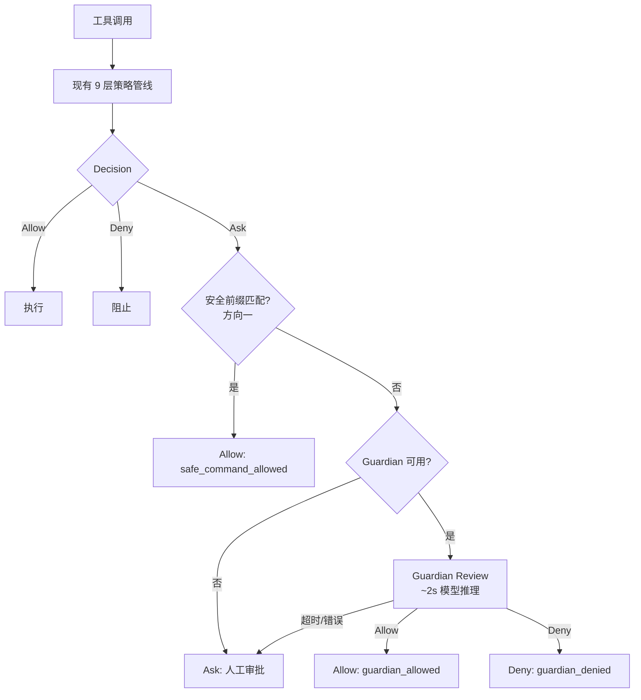

# QCode Guardian:模型审查式 Auto Review 设计方案

状态:设计稿,待评审。日期:2026-10-09。

## 1. 问题陈述

QCode 的 Auto 权限姿态使用静态效果分类决定是否需要人工审批。每个工具调用被分配一个
`Effect{Kind, Risk, Reversibility}`,当 Risk 为 medium 或以上时,Auto 姿态一律返回 Ask。

这产生两个体验问题:

1. **常见安全操作被频繁弹窗**:`git add`、`go test`、`npm install` 等只影响工作区且可通过版本控制逆
   溯的操作,与 `rm -rf` 共享同一个 risk=medium 标签。方向一(安全命令前缀匹配,提交 f38dcb9)
   已缓解已知安全命令的弹窗问题,但无法覆盖前缀列表之外的命令。

2. **静态分类无法理解命令语义**:`find . -name '*.env' -exec cat {} \;` 在效果分类中是"读文件",但语
   义上是在扫描敏感凭证;`echo 'backdoor' >> ~/.ssh/authorized_keys` 看起来是"写文件",但语义上是
   在植入后门。静态规则无法区分这两类与正常读写的差别。

本方案引入一个**模型级审查层(Guardian)**,在静态策略返回 Ask 且命令不在安全前缀列表中时,
用轻量模型推理评估实际风险并决定 Allow/Deny,替代人工审批。

## 2. 设计原则

| 原则 | 含义 |
| --- | --- |
| 安全降级 | Guardian 不可用(超时/错误/未配置)时,降级为 Ask(人工审批),绝不放行 |
| 确定性优先 | 已有确定性规则(安全前缀、typed grant)先于模型推理执行 |
| 可审计 | 每次审查记录结构化 Assessment 到 journal,可回溯"为什么允许/拒绝" |
| 可配置 | 模型选择、超时、缓存 TTL、熔断阈值均为公开配置字段 |
| 不替代硬规则 | Constitution、Repository、User 层的 Deny/Hold 不可被 Guardian 覆盖 |

## 3. 架构总览



### 审查流程(详细)

```
1. Guard 提交 PreparedInvocation → securitymodel.Assess → Effect{risk: medium}
2. 策略管线 9 层 → posture 层返回 Ask
3. 安全前缀匹配(方向一) → 未命中
4. Guardian 介入:
   a. Cache lookup: sha256(tool + args + context_digest) → 命中返回缓存
   b. 构建 Review Prompt: 命令 + 参数 + cwd + 会话上下文摘要 + 安全策略
   c. 模型推理(超时 10s,不重试)
   d. 解析结构化输出 GuardianAssessment
   e. 缓存结果(TTL 5 分钟)
5. 返回决策:
   - Allow → 工具执行,decision.Code = "guardian_allowed"
   - Deny → 阻止,agent 收到 rationale
   - 超时/解析失败 → 保持 Ask(安全降级)
```

## 4. 核心组件

### 4.1 GuardianAssessment(结构化输出契约)

```go
// internal/security/guardian/assessment.go

// RiskLevel 与 securitymodel.Risk 对齐,由 Guardian 独立评估。
type RiskLevel string
const (
    RiskLow      RiskLevel = "low"
    RiskMedium   RiskLevel = "medium"
    RiskHigh     RiskLevel = "high"
    RiskCritical RiskLevel = "critical"
)

// UserAuthorization 评估用户是否已暗示允许此类操作。
type UserAuthorization string
const (
    AuthUnknown UserAuthorization = "unknown"
    AuthLow     UserAuthorization = "low"
    AuthMedium  UserAuthorization = "medium"
    AuthHigh    UserAuthorization = "high"
)

// Outcome 是 Guardian 的最终判定。
type Outcome string
const (
    OutcomeAllow Outcome = "allow"
    OutcomeDeny  Outcome = "deny"
)

// Assessment 是模型审查的结构化输出,也是 journal 的审计记录。
type Assessment struct {
    RiskLevel         RiskLevel         `json:"risk_level"`
    UserAuthorization UserAuthorization `json:"user_authorization"`
    Outcome           Outcome           `json:"outcome"`
    Rationale         string            `json:"rationale"`
    ModelID           string            `json:"model_id"`
    LatencyMS         int64             `json:"latency_ms"`
    CacheHit          bool              `json:"cache_hit,omitempty"`
}
```

**设计约束**:Assessment 不改变 `securitymodel.Effect`——它是审查层的独立结论,与底层的
效果分类并存。策略管线消费 `Outcome`,不消费 `RiskLevel`(后者仅用于审计和 UI 展示)。

### 4.2 GuardianPrompt(审查提示)

```go
// internal/security/guardian/prompt.go

type ReviewRequest struct {
    Tool       string          // 工具名(shell, file_write, git_add 等)
    Command    string          // 完整命令或操作描述
    Arguments  json.RawMessage // 原始工具参数
    WorkingDir string          // 工作目录
    Context    string          // 会话上下文摘要(最近用户指令 + 当前任务)
}

func BuildSystemPrompt() string {
    return `You are a security reviewer for a coding agent. Assess whether the
described tool call is safe to execute automatically.

Rules:
- Allow routine development operations that only modify workspace state
  and are reversible through version control.
- Allow operations the user has explicitly or implicitly requested.
- Deny operations that could cause irreversible damage, exfiltrate
  secrets, install backdoors, or bypass security controls.
- Deny operations that scan for credentials, modify authentication
  files, or change system-level configuration.
- When uncertain, deny.

Output a JSON object with exactly these fields:
{"risk_level": "low|medium|high|critical",
 "user_authorization": "unknown|low|medium|high",
 "outcome": "allow|deny",
 "rationale": "<one sentence explanation>"}`
}

func BuildUserPrompt(req ReviewRequest) string {
    // 包含:工具名、命令/参数、工作目录、会话上下文摘要
}
```

**上下文摘要的来源**:从 Truth Capsule 提取最近 1-2 条用户指令(如 "帮我提交代码")
和当前 Plan 的 objective。这使 Guardian 能判断 user_authorization——用户明确要求执行
的操作,即使命令看起来有风险,也应给予较高的授权评分。

### 4.3 GuardianCache(结果缓存)

```go
// internal/security/guardian/cache.go

type Cache struct {
    mu      sync.RWMutex
    entries map[string]cacheEntry
    ttl     time.Duration
}

type cacheEntry struct {
    assessment Assessment
    expiresAt  time.Time
}

// CacheKey = sha256(tool + "\x00" + arguments + "\x00" + contextDigest)
// 同一命令 + 同一会话上下文 → 复用缓存
// 用户在 UI 中明确 Allow/Deny 后 → Invalidate(key) 并更新缓存
func (c *Cache) Lookup(key string) (Assessment, bool) { ... }
func (c *Cache) Store(key string, a Assessment)      { ... }
func (c *Cache) Invalidate(key string)                { ... }
```

**用户偏好学习**:当用户在 Guardian 返回 Ask 后手动 Allow,将用户的选择回写到缓存
(同 key 下次直接 Allow)。当用户手动 Deny,同理。这使 Guardian 随使用逐渐对齐用户偏好。

### 4.4 GuardianReviewer(核心审查器)

```go
// internal/security/guardian/reviewer.go

type Reviewer struct {
    provider    provider.Provider  // 模型提供者
    cache       *Cache
    timeout     time.Duration      // 默认 10s
    maxAttempts int                // 默认 1(不重试)
}

type ReviewResult struct {
    Assessment Assessment
    Err        error  // 非 nil = 降级为 Ask
}

func (r *Reviewer) Review(ctx context.Context, req ReviewRequest) ReviewResult {
    key := CacheKey(req)
    if a, ok := r.cache.Lookup(key); ok {
        return ReviewResult{Assessment: a}
    }

    ctx, cancel := context.WithTimeout(ctx, r.timeout)
    defer cancel()

    messages := []provider.Message{
        {Role: "system", Content: BuildSystemPrompt()},
        {Role: "user",   Content: BuildUserPrompt(req)},
    }

    start := time.Now()
    resp, err := r.provider.Complete(ctx, provider.Request{
        Messages:     messages,
        MaxOutputTokens: 200,     // 输出很短
        Temperature:  0,          // 确定性
    })
    if err != nil {
        return ReviewResult{Err: fmt.Errorf("guardian model call: %w", err)}
    }

    assessment, err := ParseAssessment(resp.Text)
    if err != nil {
        return ReviewResult{Err: fmt.Errorf("guardian output parse: %w", err)}
    }
    assessment.ModelID = r.provider.ModelID()
    assessment.LatencyMS = time.Since(start).Milliseconds()

    r.cache.Store(key, assessment)
    return ReviewResult{Assessment: assessment}
}
```

**关键设计**:
- `Temperature: 0`:审查需要确定性,不是创造性
- `MaxOutputTokens: 200`:JSON 输出很短,控制成本
- 不重试:失败即降级,不阻塞工具调用

### 4.5 GuardianCircuitBreaker(熔断器)

```go
// internal/security/guardian/circuit_breaker.go

type CircuitBreaker struct {
    mu                sync.Mutex
    consecutiveDenials int
    recentDenials     []bool // 滑动窗口
    windowSize        int    // 默认 10
    maxConsecutive    int    // 默认 3
    triggered         bool
}

type BreakerAction string
const (
    BreakerContinue  BreakerAction = "continue"
    BreakerInterrupt BreakerAction = "interrupt"
)

func (b *CircuitBreaker) RecordDenial() BreakerAction {
    // 连续 Deny ≥ maxConsecutive 或滑动窗口内 Deny ≥ 50%
    // → 返回 Interrupt,engine 应中断当前 turn
}
func (b *CircuitBreaker) Reset() { ... }
```

**用途**:防止 agent 被 Guardian 拒绝后反复换方式重试(改个参数再提交、换个工具名再调)。
连续被 Deny 3 次或最近 10 次中超过一半被 Deny,熔断器触发,中断 turn 并告知模型
"The automatic security reviewer has denied multiple attempts. Stop and ask the user."

## 5. 策略管线接入

### 修改 decide.go(在安全命令通路之后)

```go
// 现有代码(方向一已加入):
if decision.Action == ActionAsk && ... {
    if command, ok := invocationCommand(invocation); ok &&
        MatchesSafeCommand(DefaultCommandSafetyRules(), command) {
        decision = Decision{Action: ActionAllow, Code: "safe_command_allowed", ...}
    }
}

// 新增:Guardian 审查通路
if decision.Action == ActionAsk &&
    (decision.Layer == LayerPosture || decision.Layer == LayerUser) &&
    r.Permission == PermissionAuto && !r.DisableAutoReview &&
    !repositoryAsk && !managedAsk &&
    assessment.Effect().Risk != securitymodel.RiskHigh &&
    assessment.Effect().Risk != securitymodel.RiskCritical &&
    r.Guardian != nil {

    req := BuildReviewRequest(invocation, sessionContext)
    result := r.Guardian.Review(ctx, req)
    if result.Err == nil {
        switch result.Assessment.Outcome {
        case guardian.OutcomeAllow:
            decision = Decision{
                Action: ActionAllow, Code: "guardian_allowed",
                Reason: result.Assessment.Rationale,
                Layer:  LayerAutoReview,
            }
        case guardian.OutcomeDeny:
            decision = Decision{
                Action: ActionDeny, Code: "guardian_denied",
                Reason: result.Assessment.Rationale,
                Layer:  LayerAutoReview,
            }
        }
        // result.Err != nil → 保持 Ask(安全降级)
    }
}
```

**注意**:Guardian 可以返回 Deny,这比 Ask 更严格——Deny 阻止执行且 agent 收到 rationale。
如果用户不同意 Guardian 的 Deny,可以通过 UI 的 approval flow 覆盖(已有机制)。

### 上下文传递

`decide.go` 中的 `Invocation` 不含会话上下文。需要通过 `Runtime` 新增字段传递:

```go
type Runtime struct {
    // ... 现有字段 ...
    Guardian        *guardian.Reviewer      // 新增:Guardian 审查器
    GuardianContext func() guardian.ReviewRequest // 新增:上下文提供者(由 engine 注入)
}
```

Engine 在每个 turn 开始时设置 `GuardianContext`,提取最近的用户指令和 Plan objective。

## 6. 配置

```toml
[security.guardian]
# 是否启用 Guardian 审查。false 时所有 medium-risk 操作保持 Ask。
enabled = true

# Guardian 使用的模型。空字符串表示使用当前 Route 的模型。
# 可指定更便宜/更快的模型(如 "gpt-4o-mini"、"claude-haiku")。
model = ""

# 审查超时。超时后降级为 Ask。
timeout = "10s"

# 缓存 TTL。同一命令+上下文在 TTL 内复用缓存结果。
cache_ttl = "5m"

# 熔断器:连续 Deny 多少次后中断 turn。
max_consecutive_denials = 3

# 熔断器:滑动窗口大小。
denial_window = 10
```

## 7. 与现有机制的关系

| 层级 | Guardian 之前 | Guardian 之后 |
| --- | --- | --- |
| Constitution / Repository / User rules | Deny → 不可覆盖 | **不变**:Deny 仍不可覆盖 |
| Managed tool grants | Ask → 不可自动放行 | **不变**:managed Ask 仍需人工 |
| 安全前缀(方向一) | Allow(safe_command_allowed)| **不变**:确定性优先 |
| typed grant auto review | Allow(auto_review_allowed)| **不变**:确定性优先 |
| Guardian(新增) | N/A | Allow/Deny(guardian_allowed/denied)|
| 兜底 | Ask(人工审批)| **不变**:Guardian 失败仍 Ask |

**Guardian 只在上述所有确定性规则都未命中时才介入。**

## 8. 成本分析

| 场景 | 频率(估计) | 单次成本 | 备注 |
| --- | --- | --- | --- |
| 安全前缀命中(方向一) | ~70% 的工具调用 | 0 | 零推理 |
| Guardian 缓存命中 | ~15% | 0 | 5 分钟 TTL |
| Guardian 模型推理 | ~10% | ~200 output tokens | Temperature=0,极短输出 |
| 降级为 Ask | ~5% | 0 | Guardian 不可用或高/critical 风险 |

以 glm-4-flash 级模型估算,每次 Guardian 审查成本 < $0.001。典型 coding session 中
Guardian 介入频率约 10%(大部分操作被安全前缀或缓存覆盖),每 turn 平均额外成本 < $0.01。

## 9. 安全边界

| 边界 | 保证 |
| --- | --- |
| 高/不可逆风险不可自动放行 | RiskHigh 和 RiskCritical 效果跳过 Guardian,直接 Ask |
| Constitution/Repository 规则不可覆盖 | Guardian 在这些层之后才介入 |
| 循环 localhost 不可自动放行 | 保留现有 `public_network_target` 条件 |
| 用户可随时禁用 | `[security.guardian] enabled = false` 一键关闭 |
| 每次审查可审计 | Assessment 记录到 journal,含 rationale 和 model_id |
| 熔断器防止滥用 | 连续 Deny 中断 turn,防止 agent 绕过 |

## 10. 实现计划

| 阶段 | 内容 | 文件 | 工作量 |
| --- | --- | --- | --- |
| P1 | Guardian 包骨架:Assessment + Prompt + Cache | `internal/security/guardian/` 新包 | 1 天 |
| P2 | Reviewer:模型调用 + 输出解析 + 缓存 | 同上 | 1 天 |
| P3 | CircuitBreaker:熔断逻辑 | 同上 | 0.5 天 |
| P4 | 策略管线接入:decide.go + Runtime 字段 | `internal/security/policy/decide.go` | 0.5 天 |
| P5 | Engine 上下文注入:提取用户指令和 Plan | `internal/runtime/agent/engine/` | 1 天 |
| P6 | Wire 配置链:schema → defaults → loader → runtime | `internal/config/` + `internal/runtime/app/wire/` | 0.5 天 |
| P7 | 单测:Assessment 解析、缓存、熔断、策略接入 | `internal/security/guardian/*_test.go` | 1 天 |
| P8 | 集成测试:端到端 Guardian Allow/Deny/降级 | `internal/security/policy/` 集成测试 | 1 天 |
| P9 | 文档:configuration.md + architecture.md | `docs/zh-CN/` | 0.5 天 |
| **总计** | | | **~7 天** |

## 11. 与 cclane Guardian 的差异

| 维度 | cclane Guardian | QCode Guardian(本方案) |
| --- | --- | --- |
| 审查对象 | Shell、ApplyPatch、Network、MCP | Shell 优先;文件编辑和网络后续扩展 |
| 决策粒度 | Allow / Prompt / Forbidden | Allow / Deny / 降级 Ask |
| 模型 | 独立 Guardian 模型(可配置) | 默认用当前 Route 模型(可配置) |
| 用户授权评估 | ✅ 独立维度(UserAuthorization) | ✅ 相同 |
| 熔断器 | ✅ 连续 Deny 中断 | ✅ 相同 + 滑动窗口 |
| 缓存 | 未明确 | ✅ 命令+上下文哈希,TTL 5 分钟 |
| 审计 | 事件流 | ✅ journal + Truth Capsule |
| 确定性优先 | fast_decision 扩展钩子 | ✅ 安全前缀(方向一)+ typed grant |
| 失败降级 | 取决于策略 | ✅ 统一降级为 Ask |
| 配置 | approval_policy 配置 | TOML `[security.guardian]` 段 |

## 12. 开放问题

1. **文件编辑是否也走 Guardian?** 当前方案仅覆盖 shell 命令。文件编辑(file_write)的
   Guardian 审查需要评估目标路径(写 ~/.ssh/ vs 写 src/)——后续扩展。

2. **Guardian 与 Full Access 的关系**:Full Access(bypass)跳过所有审批,包括 Guardian。
   这是预期行为——用户选择 Full Access 就是明确放弃了审查。

3. **多模型路由**:如果用户配置了多个模型连接,Guardian 应该用哪个?当前方案默认用当前
   Route 的模型。后续可以支持 `guardian_model` 指定专用连接。

4. **Guardian 自身的沙箱**:Guardian 的模型调用是一个额外的网络请求,本身不需要沙箱
   (只做推理,不执行操作)。但需要计入 token 用量和速率限制。
