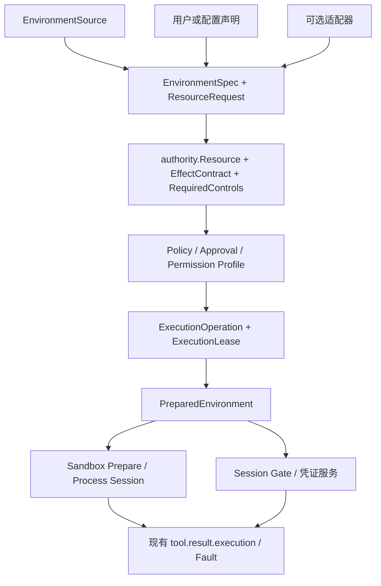

# Sandbox 执行环境重构方案

状态：可实施设计合同。日期：2026-09-21。P6 已把产品默认改为 `v1` + `native`。
同日修正：声明是通用接入路径；适配器与认证服务按接口/协议添加，不按语言清单添加。

本文是实现与验收合同。产品默认现为 `architecture.md` / `security.md` 中的
`v1` + `native`；`shared_user_temp` 仍默认关。配置层 `auth_services` 默认为空，
runtime 会绑定宿主已有的 GOPROXY 认证。`contract` 只接受 `v1`，没有回退开关。
空 `network_targets` 继承用户声明的环境网络资源到 Session Gate；未声明、
无认证服务、无 `allow_loopback` 才是离线。
原 EDS 业务工作区的编译和指定测试不因默认切换而标成完成。

实机证据见[内部依赖诊断](./sandbox-dependency-diagnosis.md)。
证书文件发现已迁入环境准备链：`BuildPolicy` 不再独立发现 CA。

## 1. 推荐决策

将 Sandbox 从“过滤命令运行所需的若干路径和变量”改为
“执行一份经过授权、可以验证、具有明确生命周期的开发环境契约”。

这是一次架构调整，不是增加 `GO*` / npm / pip 变量白名单，
也不是按编程语言逐个做插件：

- 通用核心只处理环境资源、来源、授权、物化、执行和回收。
- 通用接入是显式 `ResourceRequest`：用户、配置或 Host 登记补的精确
  路径、变量、缓存分区和网络主机，不经适配器也能准备、批准和执行。
- 适配器只把某工具的公开查询接口译成上述声明，是加速器，不是语言准入门槛。
- 模型负责业务任务，不负责猜测和重建用户的开发环境。
- 新对象必须编译进现有 Authority / Lease / Control Matrix / 执行回执，
  不建立第二套审批、日志或权限数据库。

日常本机编码的产品默认是原生环境语义、资源级授权、受控副作用：
`contract=v1`、`profile=native`。共享用户临时区、环境级站立出网和凭证交付
仍是显式 Posture，不会静默打开。子 Agent 仍固定 `isolated`。

## 2. 已冻结的实现决策

P0 关闭前不得改写这些决策来“先做一个能跑的版本”。能力不足必须报告，
不得降低调用方要求或静默扩大权限。

| ID | 决策 |
| --- | --- |
| D1 | 不新增 Agent Mode，不新增可跳过 Guard / Approval / Journal / Sandbox 的执行路径。 |
| D2 | `EnvironmentSpec` 与 `ResourceRequest` 是描述。来源可以是核心枚举、用户/配置声明或适配器输出；有效能力只来自现有 Policy、Constitution、Approval、`authority.Resource` 和 `ExecutionLease`。 |
| D3 | 不新增 Control Matrix 维度。环境资源用新的 Resource Namespace 与 Access 表达；Workspace 写语义仍由现有 `filesystem_write` 描述。 |
| D4 | P6 后主 Agent 默认 `native`。`shared_user_temp` 必须用户或显式配置打开。子 Agent 仍 `isolated`（D5）。 |
| D5 | 子 Agent 默认 `isolated`，只继承父授权与子需求的交集；不能因父级原生 Home 或共享临时区而自动同权。 |
| D6 | 首次登记只询问已绑定环境来源、用户声明的精确资源和已注册适配器的公开接口，禁止扫描整个 Home，禁止按变量名猜测敏感性。 |
| D7 | Darwin 单执行网络通道：一个 Workspace 代理进程，每个 Process Session 一个 loopback 端口和一份 Session Gate；Seatbelt 只放行该端口。Linux 在命名空间助手交付前保持进程禁网，不得 `--share-net`。 |
| D8 | 第一种需要进程外认证的**协议**闭环必须是已复现的 GOPROXY，而不是通用 HTTP 反代。第二种认证协议在 GOPROXY 闭环之后单独验收。认证服务按协议加，不按语言加。 |
| D9 | 隔离执行工作区与三方结算是独立阶段（P2b），不阻塞 P2a / P3。 |
| D10 | 每个 Workspace 只有一套环境权威：准备器。`contract` 只接受 `v1`。 |
| D11 | Skill、Agent 安装工具和 `sandbox-home` 资产继续以状态域身份存在，不跟随进程 `HOME`。 |
| D12 | `dependency_resolve` 保持现合同：禁用安装脚本、Workspace 只读。环境授权不得顺便放宽该工具。 |
| D13 | 声明是通用接入路径。没有适配器不得拒绝准备，也不得把缺失说成“不支持该语言”。核心不为新语言增加名称分支。适配器只加速公开接口翻译。 |

## 3. 已知问题与证据边界

Go 是已复现的授权闭环样本，用来证明通用资源表够用，不是产品只服务 Go。
没有逐项实测其他工具的公开接口，不能宣称它们全部发生同样故障，
也不能因此要求先写适配器才能接入。

| 当前位置 | 当前交付 | 仍保留的回退 / 边界 |
| --- | --- | --- |
| `internal/platform/process/environment.go` | 不从宿主继承语言变量；模型 extra 仍走白名单 | `SecretEnvironmentName` 继续拦截 extra |
| `internal/platform/process/process.go` | 跳过 HOME/缓存重写，使用 `sh -c` | isolated 仍把 HOME/TMPDIR 钉在 `PrivateTemp` |
| `internal/security/sandbox/toolchains.go` | 继承 PATH / 平台路径源目录和平台 SDK；跟随 PATH 目录外符号链接 | 无 |
| `internal/security/sandbox/certificates.go` | 准备器是证书权威 | 无 |
| `internal/security/sandbox/policy.go` | `PrivateTemp` 仍同时承载私有 Home 与默认临时区 | `shared_user_temp` 才把用户临时区写成独立写域 |
| `internal/runtime/app/wire` | Workspace `processEgress` 只做代理 listen/enforce | 动态授权只写 Session Gate / Web Call Scope |
| `internal/security/egress/proxy.go` | CONNECT 回收、连接前审批、origin-form 协议分发 | TLS 内部语义仍不可见 |
| `internal/adapter/tool/shell/protocol.go` | `v1` 继承用户声明网络；PTY/后台共用 Session | 适配器 GOPROXY 主机不自动 CONNECT |
| `internal/adapter/tool/shell` | 有界树写 + P2b 隔离结算 | `dependency_resolve` / `shell_read` 未放宽 |
| `internal/security/sandbox/backend.go` | Darwin 广告受控代理；Linux 保持禁网并报告 unsupported | 跨平台 Session 通道仍未交付 |

这不是已完成的漏洞审查。P1b 已覆盖共享进程 Gate：进程目标不再写入 Workspace
Gate，改由 Session Gate 持有；
并发隔离结论必须由专门集成测试证明。

## 4. 正确性前提

### 4.1 必须保护什么

仓库内容、生成命令、依赖安装脚本和子进程均不能因“用于开发”而获得宿主权限。
受保护对象包括宿主文件修改权、未授权数据读取、长期凭证、其他工作区资源、
出网目标、QCode 控制目录以及其他进程的能力句柄。

宿主用户和已被授予环境管理权限的系统组件属于配置权威。
原生同 UID 执行不能承诺抵御任意恶意宿主进程；需要这一边界时必须选择独立身份
或相应隔离后端。

### 4.2 不作无法兑现的承诺

1. Seatbelt 是访问控制，不是路径重映射。设置 `TMPDIR` 不等于改变 `confstr()`。
2. 同 UID 的 macOS 用户临时目录是共享资源。允许使用它，就不能宣称 Agent 间
   或 Workspace 间临时文件隔离。
3. HTTPS CONNECT 只控制隧道端点，不能限制内部 HTTP 方法或注入 Authorization。
4. 进程能读凭证文件，就等于拿到秘密。只读、隐藏 UI 或输出脱敏不能改变这一点。
5. 未知配置格式不能被通用代码区分为普通配置和凭证。未知资源必须显式声明。
6. 已有副作用的 shell 不能因补到权限而整段重跑。退出码 0 也不能证明被管道掩盖的构建成功。

## 5. 编译进现有授权体系

新增环境领域，不新增授权体系。实现时若发现需要第二套 Resource 类型或新的
Control Matrix 维，先改本文件，再改代码。



### 5.1 对象编译表

| 新对象 | 不是什么 | 必须落到的现有对象 |
| --- | --- | --- |
| `EnvironmentSpec` | 授权、OS 策略 | Workspace 持久环境描述；版本进入 Lease 的 Policy Revision 证据 |
| `ResourceRequest` | 权限 | `authority.Resource` + `tool.AccessMode` + EffectContract |
| `EnvironmentGrant` | 新数据库 | 现有 Permission Profile / Policy Revision 上的站立资源集 |
| `EnvironmentSnapshot` | 密钥库 | 执行回执中的环境版本、已解析工具、可用与缺失能力 |
| `PreparedEnvironment` | 长期授权 | Sandbox `Prepare` 的文件视图、进程环境和释放函数；绑定当次 Lease |
| 环境缺失 / 网络 / 凭证事实 | 新 Agent 循环 | 现有 `error_category`、`required_action`、Fault、Approval |

`ResourceRequest` 是声明 DTO，可由核心、用户或适配器产生，编译后丢弃其
“请求”身份。Lease、Guard、Journal、Sandbox 只看见 `authority.Resource`。
没有适配器时，同一编译链必须仍能处理用户给出的精确声明。

### 5.2 Resource Namespace 与 Access

现有 namespace 继续使用：`workspace`、`sandbox_home`、`broker_artifact`、
`host_toolchain`、`control_state`、`network`、`process`、`runtime`。

P2a 起新增并走协议生成命令：

| Namespace | 用途 | Access | 对应 Control |
| --- | --- | --- | --- |
| `host_config` | 宿主普通配置文件或目录 | 默认 `read`；修改另批 `write` | `filesystem_read=exact_paths` 或 `declared_roots` |
| `cache` | 命名缓存分区 | `read` / `write`；默认 Workspace 状态域 | 不扩大 `filesystem_write` 的 Workspace 语义 |
| `shared_user_temp` | 系统用户临时区 | `read`+`write`，且必须标共享 | 不伪装成 `workspace_tree` |
| `credential` | 认证能力引用 | 新增 `use`；禁止把长期秘密编成 `read` | 现有 Network / Effect；不新增 Control 维 |

`tool.AccessMode` 现有 `read` / `write`。P2a 增加公开值 `use`，表示调用认证能力
而不把秘密交给模型或普通文件系统读。协议、校验、文档和边界测试必须同步。

十维 Control Matrix 保持不变：

- Workspace 写仍是 `filesystem_write`：`denied` / `exact_paths` / `workspace_tree`。
- 出网仍是 `network`：`denied` / `loopback_exact` / `proxy_targets`。
- `sandbox_home`、`cache`、`shared_user_temp` 是额外写域，由 Resource 绑定编译进
  OS 策略，不塞进 `workspace_tree`。
- 凭证不进入进程时，不出现可读的 `credential` 文件 Resource；只出现 `use`。
- 例外凭证交付必须显式 `credential`+`read`，并在回执中标明例外。

### 5.3 站立授权如何进入单次执行

1. 用户声明与准备器输出编译进现有 `sandbox.Policy`（路径、环境值、用户声明网络）
   和当次 Process Session Gate，不新增 `EnvironmentGrant` 类型或第二套权限库。
2. Guard 构造 `ExecutionOperation` 时，把适用于当前 Subject / Effect 的授权子集
   并入 `Resources`。
3. 命令可以显式收窄（离线、拒绝共享临时区），不能以 `network_targets` 为空推断离线。
4. `ExecutionLease` 冻结该子集。Process Session 存活期间权限跟进程走，
   不跟一次 HTTP 返回或 `session_id` 走。
5. 子 Agent：父 `contract` ∩ `ChildProfile=isolated`。复制代理端口或 Session ID
   不能继承权限，也不能继承 `shared_user_temp`。

### 5.4 公开配置合同

新增 `[execution.environment]`，必须有 Provenance、校验、文档和边界测试。
探测超时和输出上限复用已有 `ToolchainProbeTimeout`（5s）与
`ToolchainProbeMaxOutputBytes`（64 KiB），不新增隐藏阈值。

| 字段 | 类型 | 默认 | 说明 |
| --- | --- | --- | --- |
| `contract` | `v1` | `v1` | 唯一合同。启用准备链；配置拒绝其它值 |
| `profile` | `isolated` \| `native` | `native` | 见第 6 节；子 Agent 运行时仍 `isolated` |
| `shared_user_temp` | bool | `false` | 仅 `native` 可开；默认关 |
| `source` | string | 空 | 空表示使用启动进程环境；非空为已绑定来源 ID |
| `resources` | 数组 | 空 | 用户声明的精确资源，与适配器输出同一编译链。仅可信配置可设；最多 64 条。`workspace` 命名空间仍按命令授权，不能写在这里 |

`v1` + `native` + `shared_user_temp=true` 是安全合同变更，必须在 UI 和文档中
同时出现，不能只改 `TMPDIR`。

## 6. 用户可见 Posture

| Posture | HOME 变量 | 宿主配置 | 临时区 | 网络 | 适用 |
| --- | --- | --- | --- | --- | --- |
| `isolated` | 指向 Workspace `sandbox-home` | 不读宿主 Home 配置 | 私有执行目录 | 无站立源，除非用户声明网络 | 子 Agent、不可信脚本、显式隔离 |
| `native`（主 Agent 默认） | 保留真实 HOME | 仅已批准 `host_config` / `host_toolchain` 只读 | 默认仍私有；可选 `shared_user_temp` | 继承已批准环境源子集 | 本机主 Agent 编码 |
| `native` + `shared_user_temp` | 同上 | 同上 | 系统用户临时区可写，无 Agent/Workspace 隔离 | 同上 | 需要原生 `mktemp` / `confstr` 的主 Agent |

HOME 变量保留不等于开放整个 Home。未接入资源显示为缺失，提供同一授权入口，
不自动开放 `~`、`~/.config` 或工具安装前缀。

### 6.1 对用户的安全合同变更

相对当前 `architecture.md`：

| 当前承诺 | `native` 之后 |
| --- | --- |
| 进程 HOME 是私有 `sandbox-home` | HOME 变量可以是宿主 Home；可读范围仍是批准文件 |
| 宿主临时区拒绝写入 | 仅当 `shared_user_temp` 打开时允许该用户临时区 |
| 凭证目录永不开放 | 默认仍不开放；认证走 `credential`+`use` |
| 空 `network_targets` 即离线 | 离线必须显式收窄；环境源可被普通命令继承 |
| 跨 Workspace 临时文件隔离 | `shared_user_temp` 下不再成立，必须对用户说明 |

`TestSandboxCompilerUsesPrivateTempAndHostTmpRemainsDenied` 以及同类断言必须按
Posture 拆开：`isolated` 继续拒绝宿主临时区；`native`+`shared_user_temp` 按共享权限验收，
不得编造跨 Agent 隔离。

### 6.2 平台能力矩阵

P0 必须把下表写成可查询的 Backend Capability，测试不具备前提时报告 `unavailable`，
不能把 skip 算通过。

| 能力 | Darwin | Linux | Windows |
| --- | --- | --- | --- |
| Strong Sandbox 文件只读根 | Seatbelt，已有 | Landlock，已有 | 报告 `unsupported`，fail closed |
| 受控代理出网 | P1b：每 Session 端口 + Session Gate | 禁网；声明目标时报 `unsupported` | `unsupported` |
| 解析系统用户临时区 | `confstr(_CS_DARWIN_USER_TEMP_DIR)` | 公开的 `TMPDIR` / `/tmp` 语义 | 公开的 `GetTempPath` 语义 |
| 私有 `/tmp` 视图 | 现 Seatbelt **不能**承诺 | 挂载命名空间，后续后端 | `unsupported` |
| 独立执行身份 / VM | 未支持 | 未支持 | 未支持 |
| 证书文件只读暴露 | 已有 `certificates.go` | 同源 | 同源，若无 OpenSSL 则仅显式文件 |

单次 OS 探测通过只证明该项控制可用，不证明业务构建成功。

## 7. 来源、首次登记与版本

### 7.1 环境来源

合法来源只有：

1. QCode 启动进程的当前环境（终端启动时可用）。
2. 用户在 Host 上显式绑定的来源快照（GUI 启动缺 shell 环境时必须走这条）。
3. 用户或配置给出的精确 `ResourceRequest`（路径、环境变量、缓存分区、网络主机、
   凭证引用）。这是没有适配器时的主路径。
4. 已注册适配器通过工具公开接口读到的非秘密配置。缺少适配器不得阻塞 1–3。

禁止：偷偷执行多个 login shell、扫描整个 Home、按 `GO*` / `TOKEN` 猜测，
以及“尚无某语言适配器”作为拒绝准备的理由。

GUI 绑定是 Host 操作，不是模型工具。用户确认后，Runtime 可以**一次**采集
非秘密环境快照并生成来源版本。采集命令本身视为可执行资源，必须显示 argv。
快照只保存来源版本、PATH、工具安装引用、用户声明和适配器输出的
`ResourceRequest`，不保存凭证原文或可离线猜测的普通哈希。

### 7.2 首次登记算法

对每个 Workspace，在 `contract=v1` 且用户打开环境登记时：

1. 解析 `execution.environment.source`。空且启动环境缺少 `HOME`/`PATH` 时，
   状态为 `source_unbound`，不猜测。
2. 冻结来源版本。后续普通命令复用，不重新全盘探测。
3. 核心枚举通用资源：来源中的 `PATH` 目录并入平台路径源（Darwin `/etc/paths`、
   存在的 `/opt/homebrew/bin` / `/usr/local/bin`）、`HOME` 变量值（只记录，
   不授权目录）、locale、已配置证书文件、Workspace `sandbox-home`、私有执行
   临时区。PATH 目录里指向目录外的可执行符号链接只读暴露解析后的安装根。
4. 合并已保存的用户/配置声明。这些声明与适配器输出进入同一编译链。
5. 对 PATH 上**已注册**适配器的可执行文件，在 `ToolchainProbeTimeout` /
   `ToolchainProbeMaxOutputBytes` 内调用其公开查询接口。超时、超限或没有
   适配器都不授予权限，也不使登记失败。
6. 适配器只输出 `ResourceRequest`。不能改环境、不能执行“修复 shell”、不能授权。
7. 未识别文件停在 `unattached`。用户可对同一授权入口补声明精确路径、变量、
   缓存目录或网络主机。补声明后的工具不必再有适配器。
8. Host 展示资源集合、用途、读写/使用/共享和风险。用户批准后写入
   现有 Policy / Permission Revision 与当次 Session Gate，不新增
   `EnvironmentGrant` 类型。Host 补声明界面尚未交付。
9. 来源变化、工具升级或凭证轮换只影响下一次准备。活跃执行走显式撤销。

核心不得出现生态名分支。Go / npm / pip / Git 若存在，只存在于
`internal/adapter/environment`，且都是可选翻译器。
Git 适配器只发现已存在的用户配置文件（`GIT_CONFIG_GLOBAL`、`~/.gitconfig`、
XDG `git/config`），不扫描 Home，不声明凭证文件。isolated 仍跳过 Home 下的
`host_config`。

### 7.3 进程与 shell

- 普通命令：固定 executable + argv。
- shell 默认非登录、非交互。
- 需要 shell 初始化时，初始化脚本本身是可执行资源，必须在 Spec 中声明。
- 受保护控制变量（代理、沙箱、凭证引用、状态域根）不能被模型覆盖。

### 7.4 适配器什么时候才需要写

多数本机编码只需要 `native`、已批准的 `host_config` / `host_toolchain`、
命令或环境级 `network` 目标。这时没有适配器也应能工作。

只有同时满足下面两条，才值得新增适配器，而不是让用户重复声明：

1. 该工具有稳定、非秘密的公开查询接口（例如 `go env -json`）。
2. 手工声明这些结果的成本明显高于一次翻译，且翻译结果仍是第 5.2 节的
   通用 namespace，不引入新的授权对象。

只有同时满足下面两条，才值得新增认证服务（P3 类），而不是再写一个适配器：

1. 长期凭证不能进入不可信进程。
2. 现有 CONNECT 目标控制无法表达该协议的认证作用域
   （模块路径前缀、registry 语义、禁止把凭证转到其他 Host）。

不得为“支持 Rust / npm / Python”本身立项适配器或认证服务。

## 8. 开工实例：已复现的 EDS / Go 失败

第 8 节是通用资源表的一个已复现样本，用来锁授权与回执，不是方案的语言范围。
P0 必须把下表做成可编译夹具。实现对照此表，而不是对照散文。
对照用的未知工具不得出现在核心里，只以声明接入。

工作区：`/Users/bytedance/eds`。目标模块：
`code.byted.org/gopkg/ctxvalues@v0.6.0`。
元信息 URL：`https://goproxy.byted.org/code.byted.org/gopkg/ctxvalues/@v/v0.6.0.info`。

### 8.1 应产出的 ResourceRequest

| 资源 | Namespace | Access | 来源 | 必需 | 生命周期 |
| --- | --- | --- | --- | --- | --- |
| `go` 可执行文件及其已解析运行依赖 | `host_toolchain` | `read` | PATH / `go env GOROOT` | 是 | 来源版本 |
| 宿主 `go env -json` 中的非秘密项：`GOPROXY`、`GONOSUMDB`、`GOSUMDB`、`GOPRIVATE`、`GO111MODULE` | 进程环境条目，来源标为 `host_config` | `read` | `go env -json` | 是 | 来源版本 |
| 持久 `go env -w` 文件（macOS 上通常为 `~/Library/Application Support/go/env`） | `host_config` | `read` | `go env GOENV` | 否 | 实时宿主文件 |
| `https://goproxy.byted.org:443` CONNECT | `network` | `read` | 解析 `GOPROXY` 的第一项 | 是 | Grant 版本 |
| `code.byted.org:443` CONNECT | `network` | `read` | **不**从 `\|direct` 自动升级 | 否 | 未批准则保持缺失 |
| GOPROXY 的凭证引用 | `credential` | `use` | 适配器声明“该源需要认证”，不读 `.netrc` 原文 | 是 | 提供者轮换版本 |
| Workspace `sandbox-home/cache/go-mod` 与 `go-build` | `cache` | `write` | 状态域，不复用宿主模块缓存 | 是 | Workspace |
| Darwin 用户临时区 | `shared_user_temp` | `write` | `confstr` | 仅 native+开关 | 共享 |
| Workspace 源文件 | `workspace` | 按命令 | Journal | 按命令 | 按命令 |

`GOPROXY=https://goproxy.byted.org|direct` 中的 `direct` 是未批准回退，
不是隐藏的第二源。诊断中补入配置后出现的 `code.byted.org ?go-get=1` Forbidden
必须继续表现为 `network_target_unapproved`，不能并进代理 401。

### 8.2 PreparedEnvironment 对这次命令的物化

`contract=v1`、`profile=native`、`shared_user_temp=true`、凭证服务已绑定该源时：

- `HOME` 保留宿主值；Seatbelt 只放行已批准的 `host_config` / `host_toolchain` 路径。
- 不把整个 `~`、`~/.netrc`、`~/.ssh` 放进只读根。
- `GOPROXY` / `GONOSUMDB` 来自 `go env`，来源写入 Snapshot。
- `GOMODCACHE` / `GOCACHE` / `GOTMPDIR` 指向 Workspace 缓存分区，不指向宿主缓存。
- `TMPDIR`/`TMP`/`TEMP` 在共享临时区开启时设为 `confstr` 结果，并写入 OS 写域。
- 进程代理变量指向**本次** Process Session 端口，不是 Workspace 共享端口。
- GOPROXY 客户端配置指向执行专属本地源或由凭证服务注入的等价源；长期密码不进环境。
- `sandbox-home` 仍作为 Skill / Agent 工具状态根注入，不改 Skill Catalog 的发现根。

### 8.3 三种已复现失败必须如何回执

| 观察 | 权威组件 | `error_category` | `required_action` | 禁止的模型结论 |
| --- | --- | --- | --- | --- |
| 私有 Home 中没有 `go env -w` 配置 | 环境准备器 | `environment_resource_unavailable` | `approve_host_config` | “宿主没有 GOPROXY” |
| 已连上 `goproxy.byted.org` 但认证失败 | 凭证服务或制品源 | `credential_unavailable` 或 `credential_rejected` | `bind_credential` | “网络不可达” |
| `mktemp -d` 写 `/var/folders/.../T` 得 EPERM | OS 后端；路径来自系统接口而非 stderr 猜测 | `filesystem_access_denied` | `enable_shared_user_temp` 或改 `isolated` | “临时目录坏了，改用 GOPROXY=off” |
| 回退打到 `code.byted.org` | Session Gate | `network_target_unapproved` | 现有网络审批 | 把 Forbidden 当成代理响应 |
| 无结构化证据的退出 | 进程回执 | `unknown` | 保留输出，不自动授权 | 扫描 `401` / `permission denied` 改判 |

这些类别在后续阶段接到准备器、Session Gate 和认证服务后仍然成立。

## 9. 文件视图、Home、缓存与临时空间

### 9.1 `sandbox-home` 迁移

现有 `<data-dir>/workspaces/<id>/sandbox-home` 继续是 Agent 持久状态域。
上线不得删除其中的 Skill、工具、会话附属物或缓存。

| 内容 | 迁移后身份 |
| --- | --- |
| Skill 安装根 | 仍由 Wire 从 Sandbox Policy / 状态域解析，见现有 `ResolveSkillPaths` 与 `TestSkillToolsAndControlUseExecutionSandboxHome` |
| Agent 安装的可执行文件 | `sandbox_home` 写域 + 环境声明接入 |
| Go 模块/编译缓存 | `cache` 分区，位于 `sandbox-home/cache/...` |
| 旧的隐式 HOME 依赖 | 删除。进程 HOME 不再是 Skill 或状态身份 |

`native` 下进程 HOME 可以是宿主 Home，但 Skill Catalog、工具安装和 QCode 控制文件
不得改去读 `$HOME`。

### 9.2 四种状态

| 状态 | 所有权 | 默认 |
| --- | --- | --- |
| 宿主安装和配置 | 宿主；获准资源只读 | 关闭整个 Home |
| Agent 持久工具状态 | Workspace `sandbox-home` | 跨 Turn 保留 |
| 缓存 | 显式分区 | 不复用宿主缓存；不把缓存当可信安装 |
| 临时空间 | 执行环境或进程；共享区必须声明 | `isolated` 私有；`shared_user_temp` 显式 |

宿主缓存复用是可选资源，不是依赖获取正确性的前提。
不支持缓存重定向的工具：要么批准其原生缓存目录写，要么用隔离配置。
不能在后台扩大目录权限。

### 9.3 Darwin 临时区

解析器必须调用公开的 `confstr(_CS_DARWIN_USER_TEMP_DIR)`，不能解析 `mktemp`
报错文本，也不能假设 `os.TempDir()` 或 `$TMPDIR` 等于该值。

QCode 控制文件、代理、凭证和 Journal 不放入共享区。
清理只删除 QCode 私有执行目录，不扫描用户整个临时区。
共享区中的任意原生命令输出不承诺按进程精确归属或全部自动清理。

不接受该边界的环境使用 `isolated`。Linux 私有 `/tmp` 是后续后端，
不能宣称 macOS Seatbelt 已支持等价视图。

### 9.4 动态目录写：P2a 与 P2b 拆开

P2a 只增加授权形状，让模型不必枚举每个新文件：

| 写形状 | 语义 | 现有对应 |
| --- | --- | --- |
| 精确文件 | 现有 `write_paths` | File Broker / Journal |
| 可写目录树 | 已存在目录的树写，变更仍要结算 | 新 Resource `tree=true` |
| 可丢弃生成目录 | 缓存或生成物，不打入源文件 Journal | `cache` 或 `sandbox_home` |

P2a 完成条件：**获批目录树内的创建/重命名/删除不必逐文件补权限**。
源文件与用户并发修改的三方结算是 P2b。

P2b（独立阶段，复用现有 child worktree、File Broker、Journal、snapshot）：

- 会改业务源文件的动态命令，优先在隔离执行工作区跑。
- 基线包含未提交和必要未跟踪输入，不能只 checkout HEAD。
- 退出后对基线做差异，经 Broker/Journal 三方检查后提交。
- 不能直接覆盖用户当时的工作区，不能用 `git reset` 回滚未知修改。
- 非 Git 工作区用同样的内容基线语义。
- 隔离工作区会改变真实 cwd，必须显示；Seatbelt 不做路径重映射。
- 原地动态写若无法可靠归属，声明非完全可回滚并走对应审批。
- 没有获批效果合同就拒绝，不绕过 Journal。

## 10. 认证与信任

凭证是“调用某项认证能力”的引用。认证服务持有上游长期凭证；
模型、普通命令和安装脚本默认拿不到它。

已有 `certificates.go` 的规则保留：公共 CA 按文件或系统信任接口提供；
客户端证书私钥按凭证处理；不关校验、不用 `-k`、不改宿主全局信任库。

### 10.1 第一种认证协议：GOPROXY 受限服务

P3 闭环的是“制品源认证协议”，不是“Go 语言支持”。没有该服务时，Go 仍可走
声明的 `host_config` / `network`；只是长期凭证不能承诺不进进程。

P3 第一个闭环：

1. 绑定确定的 GOPROXY 源、HTTPS、允许的模块路径前缀和凭证引用。
2. 执行进程只看到该 Session 的本地源端点；服务映射到固定上游。
3. 服务校验上游 TLS、完成认证、只返回允许的模块元信息和 zip。
4. 客户端 Host、路径、重定向不能改变凭证作用域。
5. 服务不执行 `go`、仓库脚本或安装钩子。
6. `\|direct` 与 `GOPRIVATE` 回退目标单独授权。

不能只反向代理第一个 URL 就宣称兼容其他制品协议。
第二种认证协议在 GOPROXY 空缓存获取、构建、测试通过后再选，并单独验收。
选定依据是协议不兼容，不是“还要支持另一种语言”。

Git credential helper 若把长期密码交还 Git，仍是向进程交付凭证，
必须标成例外，不能计入“进程不可见凭证”。

### 10.2 例外

普通 CONNECT 保持端到端 TLS，只承诺目标级控制。
本方案不默认部署通用 TLS 中间人。

无法走受限服务时，可以显式批准短期、窄作用域凭证交付。
这不是默认回退。只有长期凭证且无法限制作用域时，保留为能力缺口。

## 11. 网络

### 11.1 环境源与单次权限

用户批准的开发源形成有版本的环境策略。命令默认继承适用于当前身份和操作的子集。
离线是显式收窄。

制品源普通读取和任意目标隧道是不同能力。
CONNECT 不得包装成“只允许 GET”。
仓库配置和模型参数不能自行把新域名升级为受信任源。

### 11.2 Darwin：每 Process Session 一个端口

P1b 已落地：Workspace 仍运行一个代理进程；每个 Process Session 分配独立
loopback 端口和 Session Gate。Workspace 共享 Gate 不再写入进程目标。
Web Gate 已有 `UseCallScope`。

实现要点：

1. Workspace 仍运行一个代理进程。
2. `Prepare` 为该 Process Session 分配 `127.0.0.1` 高位端口，写入该命令的
   Seatbelt 与进程环境。
3. 该端口绑定一份 Session Gate，只含本 Lease 的网络 Resource。
4. 绑定靠 OS 放行的端口和进程生命周期，不靠模型可见 Header 或自报 Session ID。
5. 兄弟命令、子 Agent、已撤销 Session 不能连接该端口，也不能复用其 Grant。
6. `exec_command` 返回 `session_id` 不释放仍在运行进程的权限。
7. 取消、结束、撤权：停止 listen，登记并关闭已建立 CONNECT。
   `http.Server.Shutdown` 不能代替 hijacked 连接回收。
8. 端口在 Session Close 后归还；耗尽时失败为 `backend_capability_unsupported`，
   不回退到 Workspace 共享 Gate。

Linux：继续全禁网，直到受限 socketpair + 命名空间内助手落地。
声明了 `network_targets` 的进程报告 `backend_capability_unsupported`，
不回退到 Workspace 共享 Gate 或宿主网络。
忽略代理的客户端不具备该出网能力，不能自动切到不受控网络。

P3 已把 GOPROXY 认证接到 **Session loopback**，不写 Workspace 共享 Gate。
绑定 `[[execution.environment.auth_services]]` 时即使 `network_targets` 为空
也会开 Session 端口；进程只看到 `GOPROXY=http://127.0.0.1:<session-port>`。
CONNECT 到真实制品源仍须单独声明，默认拒绝。Linux/Windows 在命名空间助手
交付前对绑定了认证服务的进程报告 `backend_capability_unsupported`，
不回退到共享 Gate 或把凭证写入进程环境。

### 11.3 运行中发现新目标

代理在连接上游前产生类型化请求事实，走现有 Approval。
已覆盖则放行；新目标按 Posture。获批后追加与原执行绑定的授权修订。

等待超过客户端期限则结束该请求并保留缺失事实。
不能保证包管理器原地等待，更不能因批准迟到而重放整个安装命令。
重定向、DNS 变化、私网、代理链和认证目标均重新验证。
跨域重定向不自动转发凭证。

## 12. 失败、恢复与验证

扩展现有工具元数据，不新建 Fault 总线。名称以协议生成为准：

```text
environment_resource_unavailable
filesystem_access_denied
network_target_unapproved
credential_unavailable
credential_rejected
trust_validation_failed
upstream_unavailable
backend_capability_unsupported
source_unbound
```

每条事实必须包含证据来源组件、受限 Resource、环境和授权版本、是否已有副作用。
未经授权的路径不能完整暴露给无权主体。

事实只来自环境准备器、File Broker、Session Gate、认证服务、OS 后端
或受支持工具的结构化结果。禁止搜索 stderr 自动授权或改判根因。
macOS 拿不到精确 errno 时保留退出状态和原始输出，标记 `unknown`。

恢复：

- 启动前缺失：先授权/准备，业务尚未执行。
- 上游请求未发送：有效期内获批后可继续该请求。
- 已有副作用的 shell / 安装 / 构建：不自动整段重跑。
- 同一环境与授权版本下重复缺失同一能力：不重复生成相同审批。
- 验证保存真实被验证进程的退出状态；受信入口用 argv，不依赖管道最后一条命令。
- 任意用户 shell 无法还原内部命令成功时，只报告该 shell，不升级为编译/测试通过。

## 13. 代码所有权与旧路径删除

| Owner | 职责 |
| --- | --- |
| `internal/environment`（新增，仅合同） | `EnvironmentSpec`、`ResourceRequest`、编译到 `authority.Resource`；无生态名，不 import sandbox/process |
| `internal/adapter/environment` | 可选翻译器；公开接口 → `ResourceRequest`。无适配器时准备器仍必须接受声明 |
| `internal/security/authority`、`policy` | namespace、`AccessUse`、Grant、Lease 绑定、修订、撤销 |
| `internal/security/sandbox` | 已批准资源 → OS 约束；报告真实能力；迁出 toolchains/certificates 的环境权威 |
| `internal/security/egress` | Session 端口、Session Gate、结构化失败、CONNECT 回收 |
| `internal/platform/process` | 消费 `PreparedEnvironment`；绑定进程树、PTY、生命周期 |
| `internal/platform/environment`（新增） | 来源快照、准备、平台物化、`confstr`；无生态名 |
| `internal/runtime/app/wire` | 构造；Skill 根仍从状态域解析 |
| `internal/runtime/agent` | 消费缺失能力与 `required_action`；不新增循环 |
| `internal/host`、Web | 展示 Posture、登记、失败事实；不探测、不认证 |
| `internal/persist`、`observability` | 复用 Journal、回执、Permission；不建第二套库 |

`internal/runtime/protocol` 继续不依赖实现包。回执字段放在 protocol，
由仓库生成命令更新 Schema。

### 13.1 必须删除的旧路径

在对应阶段的同一变更集中删除，禁止双权威：

| 旧路径 | 删除点 |
| --- | --- |
| `allowedEnvironment` 中的语言变量与 `SecretEnvironmentName` 子串猜测 | 不再从宿主继承语言变量；模型 extra 仍走白名单，秘密名仍 fail-closed |
| `sandboxEnvironment` 无条件重写 HOME / TMPDIR / GO*CACHE | 已删除。HOME/缓存只由准备器或 isolated `PrivateTemp` 写入 |
| 隐式 login shell 恢复 PATH | 已删除；进程一律 `sh -c` |
| Workspace 共享动态进程 Gate | P1b 后不再写入；P5 工具审批与 shell 不再把该 Gate 当累积面 |
| `len(network_targets)==0 => DenyNetwork` | 空声明继承用户声明 Grant；未声明才离线 |
| `toolchains.go` / `certificates.go` 作为第二套环境权威 | 不再独立发现证书，也不再按语言名探测安装根；PATH / 平台路径源目录、目录外符号链接目标与 Darwin SDK 仍由平台发现 |
| `contract=legacy` 回退开关 | 已删除。配置与 `BuildPolicy` 只接受 `v1` |

### 13.2 不得顺便放宽

- `dependency_resolve`：仍禁安装脚本、Workspace 只读。
- `shell_read`：仍是只读工作区、禁网、只写私有临时区。
- 凭证目录黑名单不能代替 `ResourceRequest` 声明，但在 `v1` 落地前仍保持 fail closed。

## 14. 实施顺序

每阶段交付独立计划和结果。不能以阶段性 Go 样本成功替代通用声明路径，
也不能把它理解成语言覆盖清单。不提供未经实测的工期或性能百分比。

### P0 合同与基线

状态：合同制品已落地（2026-09-21）。当时默认行为仍是 `legacy` + `isolated`。

工作：冻结本文；把第 8 节做成可编译夹具；公开配置字段与校验；平台能力矩阵测试；
把诊断探针变为可重复基线（失败或 `unavailable`，不算通过）。

完成：原生/隔离语义无矛盾；权限变化可对用户陈述；第 2 节决策无需再改。

验证：`go test` 覆盖新配置校验与夹具；`make docs-check`。

### P1a 结构化缺失回执

状态：已落地（2026-09-21）。后续阶段已把准备器、Gate 和认证服务接到同一套
`error_category` / `required_action`；无权威事实时仍为 `unknown`。

工作：准备器、Gate、进程回执发出第 12 节类别；Agent 提示消费 `required_action`。
后续阶段已把准备器接入，不再依赖旧 HOME 重写。

完成：第 8.3 节四种误诊在集成测试中不再把“沙箱看不见”说成“宿主不存在”，
且不扫描 stderr 生成类别。

验证：`go test ./internal/adapter/tool/shell ./internal/security/egress ./internal/runtime/agent/prompt`。

### P1b 单执行网络通道

状态：已落地（2026-09-21）。Darwin 每 Process Session 一个端口和 Session Gate；
Linux/Windows 对声明了 `network_targets` 的进程报告
`backend_capability_unsupported` 并保持禁网。Workspace 共享进程 Gate 不再写入。

工作：Darwin Session 端口 + Session Gate + CONNECT 回收。Linux/Windows 报告
`unsupported` 并保持禁网。

完成：两并行进程授权互不影响；长命令保持权限；取消和撤销关闭已有连接；
攻击测试证明不能打兄弟端口。

验证：`make sandbox-attack-test`；新增 Session 隔离测试；
`TestGuard...dynamic permission leaked to shared gate` 的进程侧等价测试。

### P2a 通用资源、声明接入、原生临时区

状态：合同、声明接入与有界目录树写已落地（2026-09-21）。当时产品默认仍是
`legacy` + `isolated`。
`contract=v1` 启用准备链并跳过旧 HOME / 缓存重写；`native` 与 `shared_user_temp`
仍须显式打开。空 `network_targets` 的离线推断已在 P5 改为继承用户声明 Grant。
Go 适配器是可选翻译器样例，不是
本阶段的产品范围。Host 上的 `unattached` 补声明界面尚未交付。可信配置
`[[execution.environment.resources]]` 已进入准备链。`write_paths` 可指向已存在
工作区子目录并授予树写；工作区根仍拒绝。P2b 已把这些树写接到隔离工作区结算。

工作：`internal/environment` + 准备器；`AccessUse` 与新 namespace 的协议生成；
声明接入（无生态名的 `ResourceRequest`）与可选的第一个 Go 翻译器；
`native` / `shared_user_temp` 显式开关；证书发现迁入准备链；Skill 根回归；
目录树写授权（不含三方结算）。

完成：第 8 节资源在 `v1`+`native` 下可准备；`mktemp -d` 在共享临时区合同下成功；
核心从未识别过名称的工具只靠声明读写配置/缓存/临时文件；核心无语言名分支；
旧 HOME 重写在 `v1` 下不执行；去掉 Go 适配器后声明路径仍能准备。

验证：`go test ./internal/environment ./internal/adapter/environment ./internal/security/sandbox ./internal/platform/environment`；
现有 Skill sandbox 测试；按 Posture 拆分的临时区测试。

### P2b 隔离工作区结算

状态：命令级隔离工作区与三方结算已落地（2026-09-21）。不阻塞 P3。
当时产品默认仍是 `legacy` + `isolated`。`Isolator` 缺失时保持 P2a 原地树写；
`Begin` 失败则 `workspace_isolation_unavailable` / `use_exact_write_paths`，
不静默改回原地写。

工作：`internal/orchestration/execsettle` 为带有已存在写树的 `exec_command`
准备独立 cwd；Git 工作区用 detached worktree + dirty/untracked Snapshot，
非 Git 工作区用内容副本加私有 baseline。退出后 `chatmerge.PlanPaths` /
`ApplyPaths` 只结算声明树前缀，经 File Broker 与当前 Turn Journal 三方提交。
用户并发修改不自动算 Agent 修改；重叠冲突拒绝且不覆盖父工作区。隔离 cwd
写入 `isolated_cwd`；Seatbelt 不重映射路径。子 Agent 仍使用自己的 worktree，
不复用父 Isolator。

完成：动态目录写可结算；`user.txt` 上的并发用户编辑不会随 `generated/`
树写一起落入 Journal。

验证：`go test ./internal/orchestration/execsettle ./internal/orchestration/chatmerge
./internal/adapter/tool/shell ./internal/adapter/tool/guard`。

### P3 GOPROXY 认证协议，再选第二种协议

状态：第一种认证协议 GOPROXY 已落地（2026-09-21）。第二种协议未选，
配置层拒绝未知 protocol。产品默认不写 `auth_services`，但会绑定宿主已有的
GOPROXY 认证。

工作：GOPROXY 受限服务；长期凭证不进不可信进程；空缓存获取。
这是认证协议闭环，不是“把 Go 做完”。GOPROXY 闭环后再选**协议不兼容**的
第二种认证服务；不得按语言清单立项。

实现要点：

1. 可信配置 `[[execution.environment.auth_services]]` 覆盖绑定；最多 8 条，
   当前实现只接受 1 个 `protocol = "goproxy"`。配置为空时，runtime 绑定宿主
   `go env GOPROXY` 已有的 userinfo 或宿主 `~/.netrc`，前缀为 `*`（宿主代理
   原本就承接全部模块）。没有宿主凭证则保持未绑定。第二种协议未开放。
2. `upstream` 必须是 https 源点（loopback 可用 http），禁止 userinfo / query /
   path；凭证只允许 `env` / `file` / `keyring` / `host` 引用。
3. 服务挂在现有 Process Session loopback 上，不新增端口，也不写共享 Gate。
4. Origin-form GET/HEAD 进协议处理；对已绑定上游主机的 CONNECT 与
   absolute-form 记 `trust_validation_failed` 并拒绝。其他 CONNECT 仍走
   Session Gate。
5. 进程环境被改写为 `GOPROXY=http://127.0.0.1:<session-port>`，去掉 `|direct`
   与上游秘密。`GOPRIVATE` 回退目标单独授权。
6. 跨主机重定向不转发 Authorization。前缀外模块记
   `trust_validation_failed`；上游 401/403 记 `credential_rejected`。
7. 单次上游获取公共上限：拨号 10s、TLS 握手 10s、客户端 30s
   （`goproxy.DialTimeout` / `TLSHandshakeTimeout` / `ClientTimeout`）。

完成：受控测试源上空缓存 `@v/*.info` 返回真实版本元信息；
`credential_rejected` 与 `network_target_unapproved` 可区分；
长期凭证不出现在 argv / 进程环境 / 回执 / 模型上下文。
第二种协议尚未立项。

验证：`go test ./internal/security/goproxy ./internal/security/egress
./internal/adapter/tool/shell ./internal/adapter/tool/guard
./internal/runtime/app/wire ./internal/config`；默认 CI 不使用真实长期凭证。

### P4 运行中审批与恢复

状态：连接前审批与去重已落地（2026-09-21）。产品默认 Approval Posture 未改。

工作：连接前审批；超时、拒绝、部分执行不盲目重放；与现有 Approval Posture 对齐。

实现要点：

1. 代理 CONNECT / HTTP 转发和 Web RoundTrip 在拨号前走
   `AuthorizeBeforeConnect`；探测用的 `Authorize` 仍当场拒绝，不能因此补授权。
2. 未覆盖目标调用现有 `approveEgressTarget` / Approval Posture；获批后只写入
   当前 Session Gate 或 Web Call Scope，不写 Workspace 共享 Gate。
3. 同一执行内同一 origin 只问一次：并发等待共用一次审批，拒绝或超时后不再问。
4. 等待超过请求期限则结束该请求并保留 `network_target_unapproved` 事实，
   `retry_original=false`。不能保证包管理器原地等待。
5. 已开始的进程命令（`CapabilityProcess` 或已 journal）不得因出网缺失整段重放。
   Web 在未问过审批时仍可对未连接的跳转重试一次。

完成：请求先批准后连接；同一缺失不重复生成审批，也不整段重放已有副作用的命令。

验证：`go test ./internal/security/egress ./internal/adapter/tool/guard
./internal/adapter/tool/web ./internal/adapter/tool/shell`。

### P5 收敛并删除旧路径

状态：已落地（2026-09-21）。后续默认切换见 P6。

工作：主/子 Agent、Skill、PTY、后台进程共用契约；Linux 助手若未交付则如实报告；
删除第 13.1 节旧路径。

实现要点：

1. 子 Agent 使用父级 `contract`，`ChildProfile` 固定 `isolated`，不继承
   `shared_user_temp`；Skill 根仍是 `sandbox-home`（D11）。PTY 与后台走同一
   `exec_command` / Session 通道。
2. `v1` 空 `network_targets` 只继承用户声明的 `namespace=network` 到 Session
   Gate，不继承适配器发现的 GOPROXY 主机，也不写 Workspace 共享 Gate。
3. 不再从宿主继承 `GO*` 语言变量；准备器物化值与模型 extra 才进入进程。
   `SecretEnvironmentName` 仍拦截 extra。HOME/缓存重写与 login shell 已删除。
4. 工具审批不再接收进程 Gate。Workspace `processEgress` 只做代理 listen/enforce。
5. Linux Landlock 助手只编码文件系统规则；无法交付 Session 通道时报告
   `backend_capability_unsupported`，不 `--share-net`。

完成：无共享动态进程授权，无隐式环境路径，无双权威。默认切换见 P6。

验证：`go test ./internal/environment ./internal/security/sandbox
./internal/platform/process ./internal/adapter/tool/shell
./internal/runtime/app/wire`；`make docs-check`。

### P6 默认切换

状态：产品默认已切换（2026-09-21）。`shared_user_temp` 与认证服务仍默认关。

工作：选定 Workspace 完整矩阵通过后，才把推荐默认改为 `v1`+`native`。
`shared_user_temp` 仍默认关，除非该 Workspace 明确需要原生 `mktemp`。

实现要点：

1. 配置默认值为 `contract=v1`、`profile=native`、`shared_user_temp=false`，
   `auth_services` 为空。runtime 仍绑定宿主已有的 GOPROXY 认证。`contract`
   拒绝其它值。`isolated` 仍是子 Agent 固定姿态，也可由主 Agent 显式选择。
2. 主 Agent 保留宿主 HOME 变量，但不开放整个 Home，也不打开共享用户临时区。
   子 Agent 仍 `ChildProfile=isolated`。
3. 仓库内标准库样本模块在默认合同下执行 `go test`，并与宿主同输入对照。
   这是验收样本，不是“已支持语言”清单，也不把原 EDS 业务任务标成完成。
4. Linux/Windows 网络通道能力不足时仍报告 `backend_capability_unsupported`。

完成：默认合同可真实编译并跑指定测试；文档区分已交付默认与原 EDS 业务证据。

验证：`go test ./internal/config ./internal/environment
./internal/platform/environment ./internal/runtime/app/wire
./internal/adapter/environment`；`make docs-check`。

若 P0 发现平台边界无法满足，修正执行配置或实现后端，不得为通过检查而扩大权限。

## 15. 验收矩阵

### 15.1 按阶段必须先成立

| 阶段 | 必须成立 |
| --- | --- |
| P1a | 配置缺失、认证失败、未批准出网、临时区 EPERM 可区分 |
| P1b | 命令 A 的目标不能被命令 B、兄弟 Agent、已撤销进程消费 |
| P2a | 第 8 节准备成功；`mktemp` 按 Posture 成立；未知工具只靠声明接入且无适配器也能准备；Skill 仍在 `sandbox-home` |
| P3 | 空缓存 GOPROXY 协议获取成功；长期凭证不出现在 argv/环境/日志/模型上下文 |
| P2b | 动态目录写可结算；用户并发修改不自动算 Agent 修改 |
| P6 | 真实构建与指定测试；与宿主同输入对照 |

### 15.2 正常开发（不因默认切换而自动成立）

- 原 EDS 项目从空缓存经内部源获取依赖，执行真实构建及指定测试。这是样本，
  不是“已支持语言”清单。
- 已声明资源的真实工具必须能跑；有适配器只减少手工声明。企业源单独、显式启用。
- 核心从未识别过名称的测试工具，不为它加名称分支，也不要求先写适配器。
- 宿主已有缓存、空缓存、配置变化、不同安装位置都覆盖。
- 长命令、PTY、`write_stdin`、嵌套子进程、主/子 Agent、服务重启有明确归属。

### 15.3 拒绝与权限不混用

- 未批准的宿主配置、凭证库、QCode 控制目录及其他 Workspace 不能读或改。
- DNS 重绑定、跨源重定向、私网、Host 伪造和被替换路径不能扩大授权。
- 认证服务不能被诱导向另一源发送凭证，不能变成任意 HTTP 写入或签名代理。
- 忽略代理、直接 IP、其他 Loopback 和跨执行代理端口不能绕过策略。
- 原生共享临时区按真实共享权限验收。

### 15.4 失败与性能

- 有权威证据时区分网络未授权、认证失败、TLS 失败、上游不可用、文件无权限和不存在。
- 审批拒绝/过期、环境版本变化、取消、代理崩溃、重启不泄漏能力句柄或活动授权，
  不把业务步骤重复执行。
- 环境来源按版本复用，普通命令不重新执行所有工具探测。
- 对照启动延迟、下载吞吐和并发内存时，共享不可变描述，活跃授权和连接保持独立。

实现阶段使用已有 `test-platform-capability`、`sandbox-attack-test`、
Package/Race 测试及协议生成命令。

## 16. 发布

产品默认现为 `execution.environment.contract=v1` 与 `profile=native`。
没有环境合同回退开关。已发生的外部副作用不承诺自动回滚。

协议和回执变更使用 `make protocol-schema` 等仓库生成命令。
文档继续区分已交付能力与本提案；不因为方案完成就把原 EDS 业务任务标成完成。
